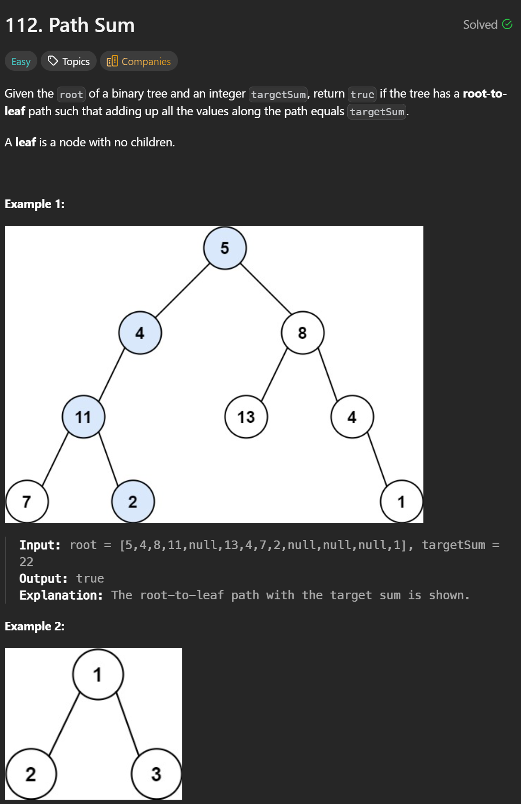

```cpp
/**
 * Definition for a binary tree node.
 * struct TreeNode {
 *     int val;
 *     TreeNode *left;
 *     TreeNode *right;
 *     TreeNode() : val(0), left(nullptr), right(nullptr) {}
 *     TreeNode(int x) : val(x), left(nullptr), right(nullptr) {}
 *     TreeNode(int x, TreeNode *left, TreeNode *right) : val(x), left(left), right(right) {}
 * };
 */
class Solution {
public:
    bool hasPathSum(TreeNode* root, int targetSum) {
        if(!root) return false;

        int remain = targetSum - root->val;
        if(!root->left && !root->right && remain == 0) return true;
        
        return hasPathSum(root->left, remain) || hasPathSum(root->right, remain);
    }
};
```


Stack DFS

```cpp
/**
 * Definition for a binary tree node.
 * struct TreeNode {
 *     int val;
 *     TreeNode *left;
 *     TreeNode *right;
 *     TreeNode() : val(0), left(nullptr), right(nullptr) {}
 *     TreeNode(int x) : val(x), left(nullptr), right(nullptr) {}
 *     TreeNode(int x, TreeNode *left, TreeNode *right) : val(x), left(left), right(right) {}
 * };
 */
class Solution {
public:
    bool hasPathSum(TreeNode* root, int targetSum) {
        if (!root) return false;

        stack<pair<TreeNode*, int>> st;
        st.push({root, targetSum - root->val});

        while(!st.empty()){
            auto [node,remain] = st.top();
            st.pop();

            if(!node->left && !node->right && remain == 0) return true;

            if(node->right) st.push({node->right, remain - node->right->val});
            if(node->left) st.push({node->left, remain - node->left->val});
        }

        return false;
    }
};
```