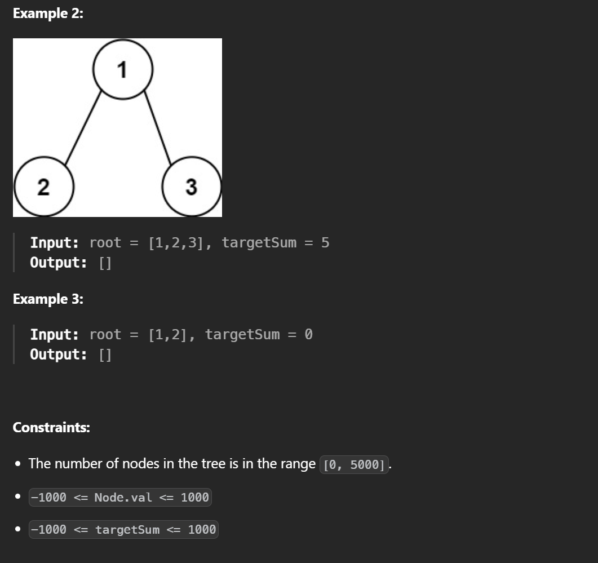

```cpp
/**
 * Definition for a binary tree node.
 * struct TreeNode {
 *     int val;
 *     TreeNode *left;
 *     TreeNode *right;
 *     TreeNode() : val(0), left(nullptr), right(nullptr) {}
 *     TreeNode(int x) : val(x), left(nullptr), right(nullptr) {}
 *     TreeNode(int x, TreeNode *left, TreeNode *right) : val(x), left(left), right(right) {}
 * };
 */
class Solution {
public:
    vector<vector<int>> pathSum(TreeNode* root, int targetSum) {
        vector<vector<int>> res;
        vector<int> path;

        function<void(TreeNode*,int)> backtrack = [&](TreeNode* node, int remain) {
            if(!node) return;
            path.push_back(node->val);
            remain -= node->val;
            if(!node->left && !node->right && remain == 0) {
                res.push_back(path);
            } else {
                backtrack(node->left, remain);
                backtrack(node->right, remain);
            }

            path.pop_back();
        };

        backtrack(root, targetSum);
        return res;
    }
};
```