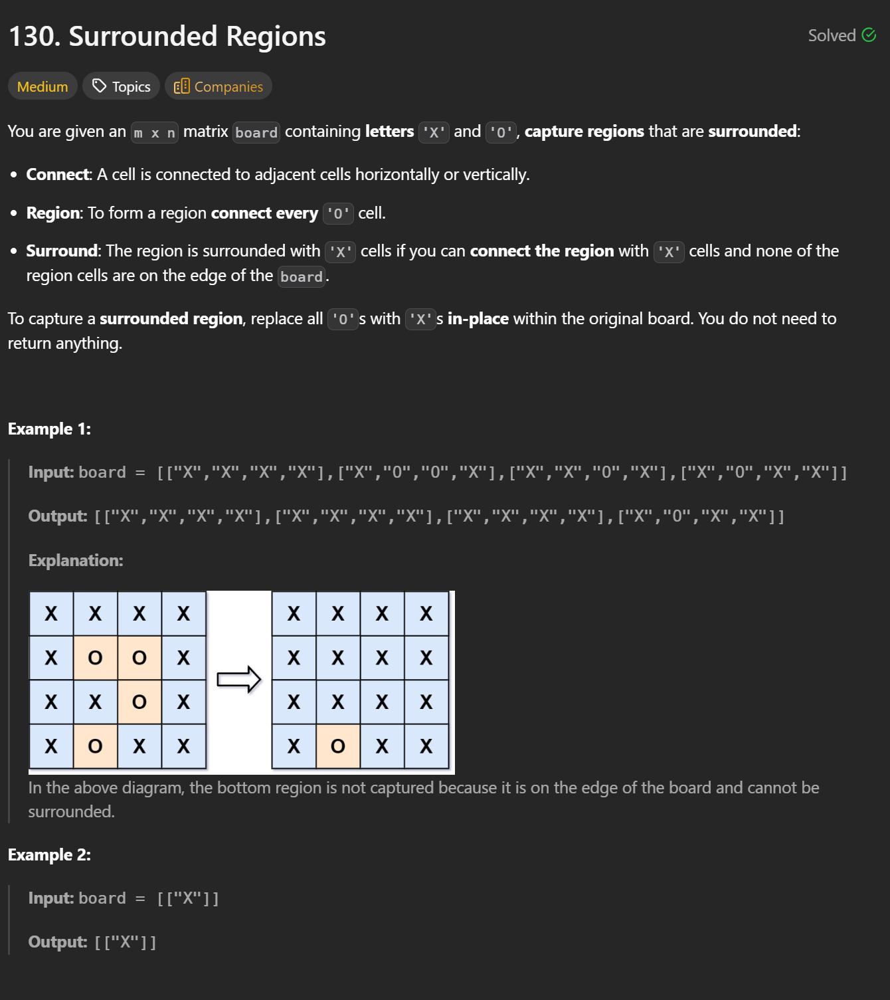
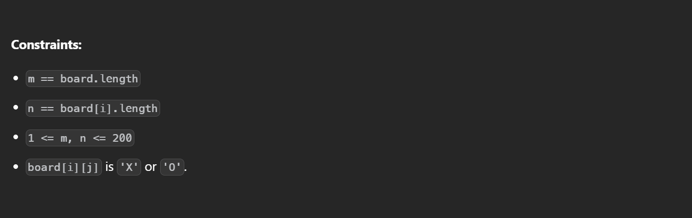

```cpp
class Solution {
public:
    void solve(vector<vector<char>>& board) {
        int m = board.size();
        int n = board[0].size();

        function<void(int,int)> dfs = [&](int i, int j) {
            if(i < 0 || j < 0 || i >= m || j >= n || board[i][j] != 'O') return;
            board[i][j] = '.';
            dfs(i - 1, j);
            dfs(i + 1, j);
            dfs(i, j - 1);
            dfs(i, j + 1);
        };

        for(int i = 0; i < m; i++) {
            for(int j = 0; j < n; j++) {
                if(i == 0 || j == 0 || i == m - 1 || j == n - 1) {
                    if(board[i][j] == 'O') {
                        dfs(i, j);
                    }
                }
            }
        }

        for(int i = 0; i < m; i++) {
            for(int j = 0; j < n; j++) {
                if(board[i][j] == 'O') board[i][j] = 'X';
                if(board[i][j] == '.') board[i][j] = 'O';
            }
        }
    }
};
```


The key idea is to work from the boundary instead of checking each O individually.

A region is not surrounded if it can reach the board boundary through adjacent O cells.
Therefore, we start DFS/BFS from all Os on the boundary and mark every reachable O as safe.

After this process:

All remaining Os cannot reach the boundary, so they must be surrounded and should be flipped to X.

The marked safe cells are restored back to O.

This approach avoids repeated searches and guarantees efficiency.

---

**Time Complexity: O(M*N)**  
**Space Complexity: O(M*N)**