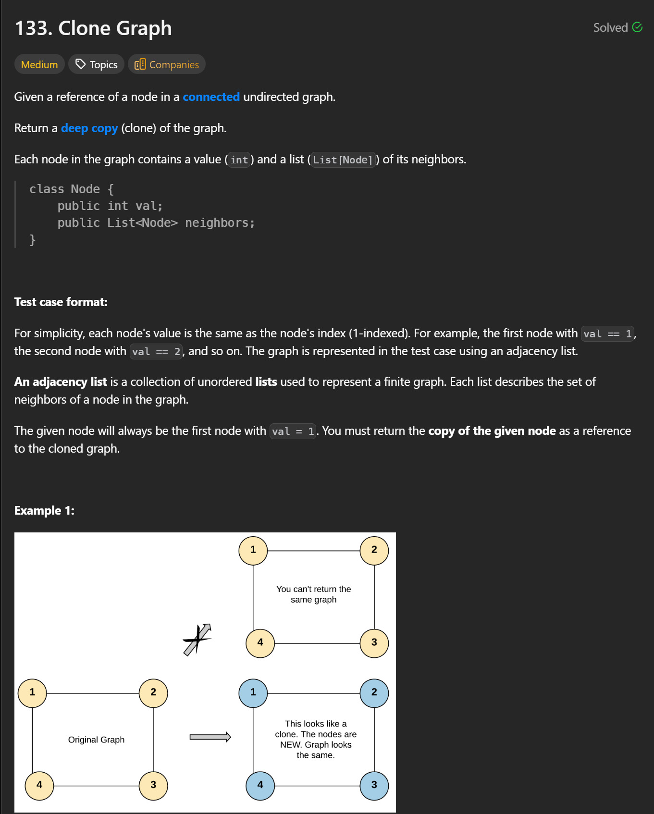
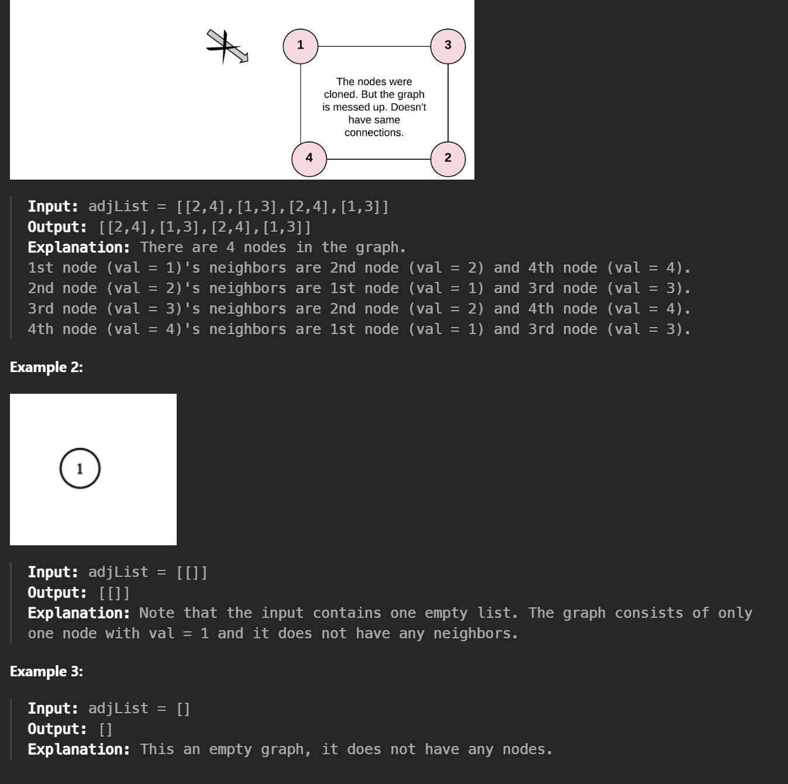
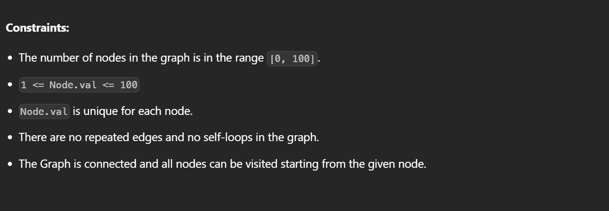

### DFS  

```cpp
/*
// Definition for a Node.
class Node {
public:
    int val;
    vector<Node*> neighbors;
    Node() {
        val = 0;
        neighbors = vector<Node*>();
    }
    Node(int _val) {
        val = _val;
        neighbors = vector<Node*>();
    }
    Node(int _val, vector<Node*> _neighbors) {
        val = _val;
        neighbors = _neighbors;
    }
};
*/

class Solution {
public:
    unordered_map<Node*, Node*> map;
    Node* cloneGraph(Node* node) {
        if(!node) return nullptr;
        if(map.count(node)) return map[node];
        Node* clone = new Node(node->val);
        map[node] = clone;
        for(auto n : node->neighbors) {
            clone->neighbors.push_back(cloneGraph(n));
        }
        return clone;
    }
};

/*
map:{node: cloneNode}
*/
```


### BFS

```CPP
/*
// Definition for a Node.
class Node {
public:
    int val;
    vector<Node*> neighbors;
    Node() {
        val = 0;
        neighbors = vector<Node*>();
    }
    Node(int _val) {
        val = _val;
        neighbors = vector<Node*>();
    }
    Node(int _val, vector<Node*> _neighbors) {
        val = _val;
        neighbors = _neighbors;
    }
};
*/

/*
// Definition for a Node.
class Node {
public:
    int val;
    vector<Node*> neighbors;
    Node() : val(0) {}
    Node(int _val) : val(_val) {}
    Node(int _val, vector<Node*> _neighbors) : val(_val), neighbors(_neighbors) {}
};
*/

class Solution {
public:
    Node* cloneGraph(Node* node) {
        if (!node) return nullptr;

        unordered_map<Node*, Node*> mp;  // original -> clone
        queue<Node*> q;

        // 1) 先 clone 起点（只填 val）
        mp[node] = new Node(node->val);
        q.push(node);

        // 2) BFS 扩展：遇到没 clone 过的邻居就先 clone + 入队
        while (!q.empty()) {
            Node* cur = q.front();
            q.pop();

            for (Node* nei : cur->neighbors) {
                if (!mp.count(nei)) {
                    mp[nei] = new Node(nei->val);
                    q.push(nei);
                }
                // 3) 连边：cur 的 clone 指向 nei 的 clone
                mp[cur]->neighbors.push_back(mp[nei]);
            }
        }

        return mp[node];
    }
};


```