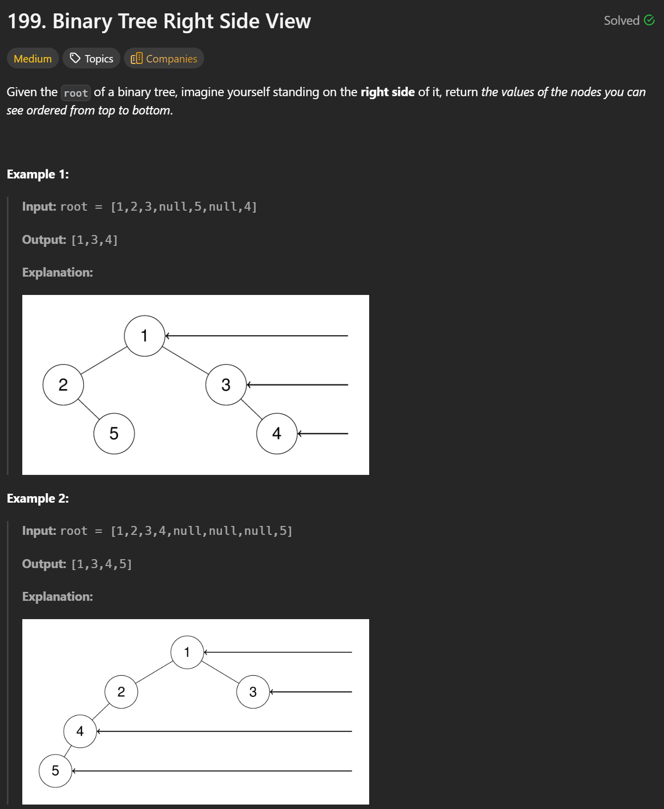
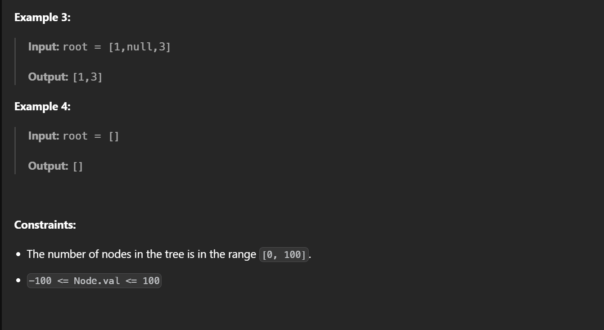

## BFS 

```cpp
class Solution {
public:
    vector<int> rightSideView(TreeNode* root) {
        // Edge case: empty tree
        if (!root) return {};

        vector<int> res;
        queue<TreeNode*> q;

        // Start BFS from the root
        q.push(root);

        while (!q.empty()) {
            int size = q.size();  // Number of nodes in the current level

            for (int i = 0; i < size; i++) {
                TreeNode* node = q.front();
                q.pop();

                // Push children for the next level
                if (node->left) q.push(node->left);
                if (node->right) q.push(node->right);

                // The last node in this level is the rightmost one
                if (i == size - 1) {
                    res.push_back(node->val);
                }
            }
        }
        return res;
    }
};
```

---

## Problem Summary
Given the root of a binary tree, imagine standing on the **right side** of the tree.  
Return the values of the nodes you can see, ordered from **top to bottom**.

This is a **level-based visibility problem**.

---

## Core Idea (BFS – Level Order Traversal)

We traverse the tree **level by level** using **Breadth-First Search (BFS)**.

Key observation:
> From the right side, **only the last node in each level is visible**.

So for each level:
1. Process all nodes in that level.
2. Record the value of the **last node popped** from the queue.

---

## Why This Works

- BFS guarantees nodes are processed **level by level**
- At each level, nodes are visited from **left to right**
- The **last node processed** in a level is exactly what you would see from the right side

This avoids unnecessary position tracking (such as column indices).

---

## Time Complexity

- **O(n)**  
  Each node is visited exactly once.

---

## Space Complexity

- **O(w)** where `w` is the maximum width of the tree  
  (Queue stores at most one full level at a time)

Worst case (complete binary tree): `O(n)`

---

## Key Takeaway

- This problem is about **levels**, not coordinates
- BFS + “take the last node of each level” is:
  - Simple
  - Intuitive
  - Interview-safe
- A classic example of using **level-order traversal** to extract structured information from a tree

---
