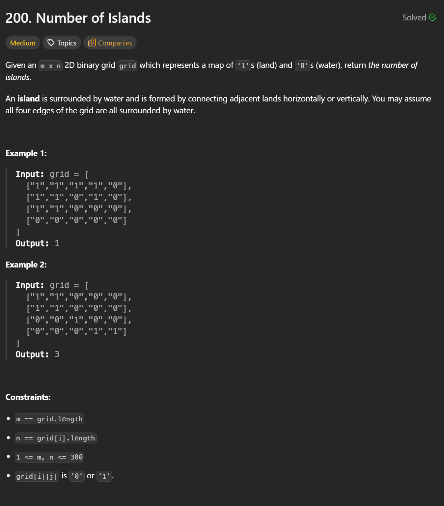

```cpp
class Solution {
public:
    int numIslands(vector<vector<char>>& grid) {
        int m = grid.size();
        int n = grid[0].size();
        int res = 0;

        function<void(int,int)> backtrack = [&](int i, int j) {
            if(i < 0 || j < 0 || i >= m || j >= n || grid[i][j] != '1') return;
            grid[i][j] = 0;

            backtrack(i - 1, j);
            backtrack(i + 1, j);
            backtrack(i, j - 1);
            backtrack(i, j + 1);

        };

        for(int i = 0; i < m; i++) {
            for(int j = 0; j < n; j++) {
                if(grid[i][j] == '1') {
                    backtrack(i, j);
                    res++;
                }
            }
        }
        return res;
    }
};
```
---
**Time Complexity: O(M*N)**   
**Space Complexity: O(M*N)**
