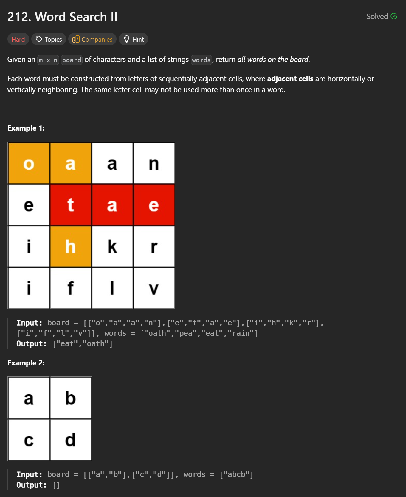
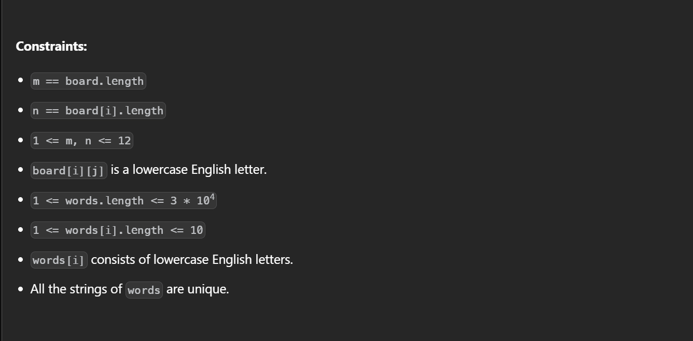

```cpp
// Trie node = one prefix state in the dictionary.
struct TrieNode {
    // Map from next character -> pointer to the next TrieNode.
    // Example: children['a'] points to the node that represents adding 'a' to current prefix.
    unordered_map<char, TrieNode*> children;

    // If this node ends a word, store the full word here; otherwise "".
    // We store the full word so we can output it immediately when we reach this node in DFS.
    string endword;
};

class Solution {
public:
    vector<string> findWords(vector<vector<char>>& board, vector<string>& words) {

        TrieNode* root = new TrieNode();                 // Root of Trie: represents empty prefix "".

        // ---------- Build Trie from all words ----------
        for (auto word : words) {                        // Insert each word into the Trie.
            TrieNode* node = root;                       // Start from root for each word.
            for (char letter : word) {                   // Walk characters in this word.
                // node->children[letter] returns a TrieNode* (default nullptr if key not present).
                if (!node->children[letter])             // If this edge doesn't exist yet...
                    node->children[letter] = new TrieNode(); // Create the next Trie node.
                node = node->children[letter];           // Move "node" forward along the Trie path.
            }
            node->endword = word;                        // Mark: this Trie path completes a word.
        }

        int m = board.size();                            // Number of rows in board.
        int n = board[0].size();                         // Number of cols in board.
        vector<string> res;                              // Final answers (found words).

        // backtrack(i, j, node) means:
        // - We are standing on board cell (i, j)
        // - "node" is the Trie node for the prefix matched BEFORE using board[i][j]
        // - We will try to consume board[i][j] as the next letter in the Trie.
        function<void(int, int, TrieNode*)> backtrack =
            [&](int i, int j, TrieNode* node) {

            char letter = board[i][j];                   // Current board character we want to match.

            // Find whether this Trie prefix can go to "letter".
            auto it = node->children.find(letter);       // it points to (key=letter, value=nextNode).
            if (it == node->children.end()) return;      // No such edge => no word can match => prune.

            TrieNode* curr = it->second;                 // Move Trie state forward: prefix + letter.

            // If curr ends a word, we found one word on the board path.
            if (!curr->endword.empty()) {                // endword != "" means "this prefix is a full word"
                res.push_back(curr->endword);            // Add it to results.
                curr->endword.clear();                   // Clear to avoid duplicates (same word found again).
            }

            board[i][j] = '.';                           // Mark this cell as visited (can't reuse in path).

            pair<int, int> dirs[] = {                    // 4-direction moves.
                {-1, 0}, { 1, 0}, { 0,-1}, { 0, 1}
            };

            for (auto [di, dj] : dirs) {                 // Try each direction from current cell.
                int x = i + di;                          // Next row.
                int y = j + dj;                          // Next col.

                // Check boundaries and also ensure we don't step into a visited cell '.'.
                if (x >= 0 && y >= 0 && x < m && y < n && board[x][y] != '.') {
                    backtrack(x, y, curr);               // DFS to neighbor with updated Trie state.
                }
            }

            board[i][j] = letter;                        // Restore original letter (undo visited mark).
        };

        // ---------- Start DFS from every cell ----------
        for (int i = 0; i < m; i++) {                    // For each row...
            for (int j = 0; j < n; j++) {                // For each col...
                backtrack(i, j, root);                   // Try to start matching from this cell.
            }
        }

        return res;                                      // Return all found words (unique).
    }
};

```