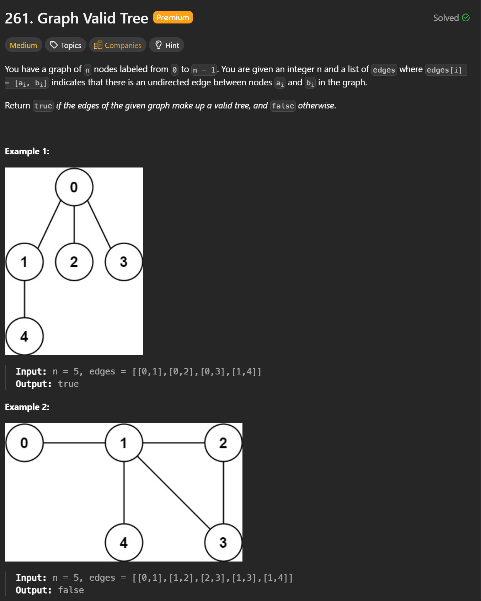
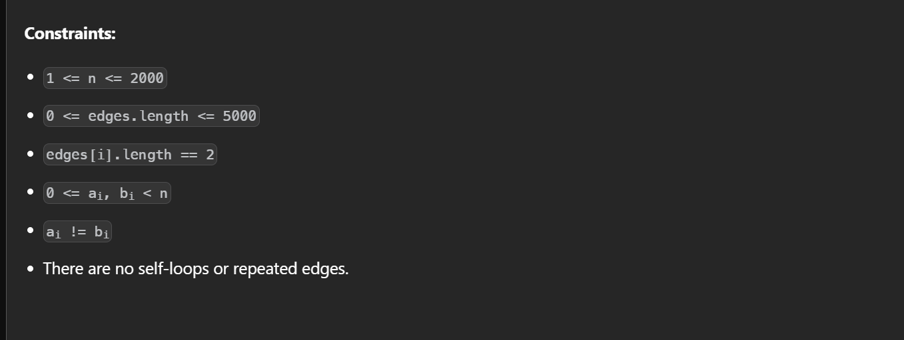

```cpp
class Solution {
public:
    bool validTree(int n, vector<vector<int>>& edges) {
        if(edges.size() != n - 1) return false;
        vector<int> parent(n);
        vector<int> rank(n, 0);

        for(int i = 0; i < n; i++) parent[i] = i; // the initial parent is itself.

        function<int(int)> find = [&](int x) {
            if(parent[x] == x) return x;
            parent[x] = find(parent[x]);
            return parent[x];
        };

        auto unite = [&](int a, int b) {
            int pa = find(a);
            int pb = find(b);
            if(pa == pb) return false;
            if(rank[pa] < rank[pb]) swap(pa, pb);
            parent[pb] = pa;
            if(rank[pa] == rank[pb]) rank[pa]++;
            return true;
        };

        for(const auto &e : edges) {
            if(!unite(e[0], e[1])) return false;
        }

        return true;
    }
};
```


### Time Complexity

- Initializing the `parent` and `rank` arrays takes **O(n)**.
- We iterate through all edges once. For each edge, we perform `find` and `union`.
- With **path compression** and **union by rank**, each `find/union` operation runs in **O(α(n))** amortized time, where α is the inverse Ackermann function (very small in practice).

**Overall time complexity:**  
**O(n · α(n))**, which is effectively **O(n)**.

---

### Space Complexity

- The `parent` array uses **O(n)** space.
- The `rank` array uses **O(n)** space.
- The recursion stack for `find` is very small due to path compression.

**Overall space complexity:**  
**O(n)**.
