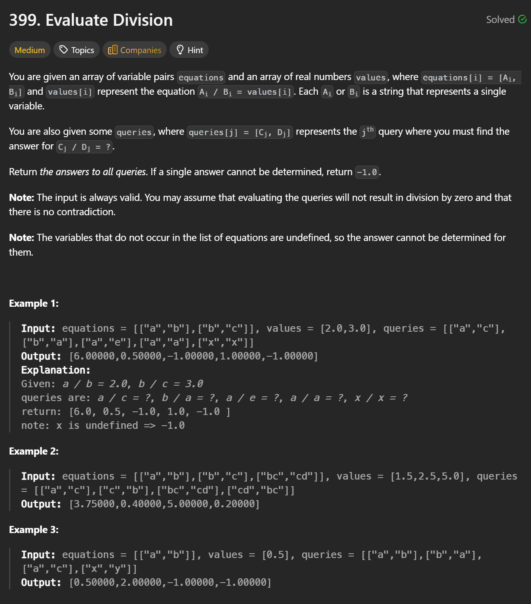
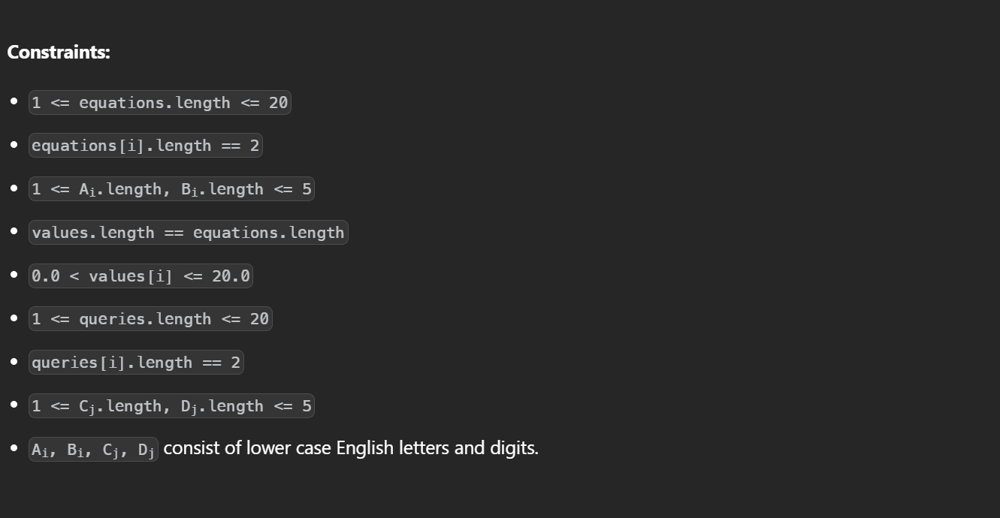

```cpp
class Solution {
public:
    vector<double> calcEquation(vector<vector<string>>& equations,
                                vector<double>& values,
                                vector<vector<string>>& queries) {

        unordered_map<string, string> parent;
        unordered_map<string, double> weight; // x / parent[x]

        auto add = [&](string x) {
            if (!parent.count(x)) {
                parent[x] = x;
                weight[x] = 1;
            }
        };

        function<pair<string,double>(string)> find = [&](string x) {
            if (parent[x] == x)
               return make_pair(x, 1.0);

            auto res = find(parent[x]);
            parent[x] = res.first;
            weight[x] *= res.second;
            return make_pair(parent[x], weight[x]);
        };

        auto unite = [&](string a, string b, double val) {
            add(a);
            add(b);

            auto pa = find(a);
            auto pb = find(b);

            if (pa.first == pb.first) return;

            parent[pa.first] = pb.first;
            weight[pa.first] = val * pb.second / pa.second;
        };

        for (int i = 0; i < equations.size(); i++) {
            unite(equations[i][0], equations[i][1], values[i]);
        }

        vector<double> res;
        for (auto q : queries) {
            if (!parent.count(q[0]) || !parent.count(q[1])) {
                res.push_back(-1);
                continue;
            }

            auto pa = find(q[0]);
            auto pb = find(q[1]);

            if (pa.first != pb.first)
                res.push_back(-1);
            else
                res.push_back(pa.second / pb.second);
        }

        return res;
    }
};

```