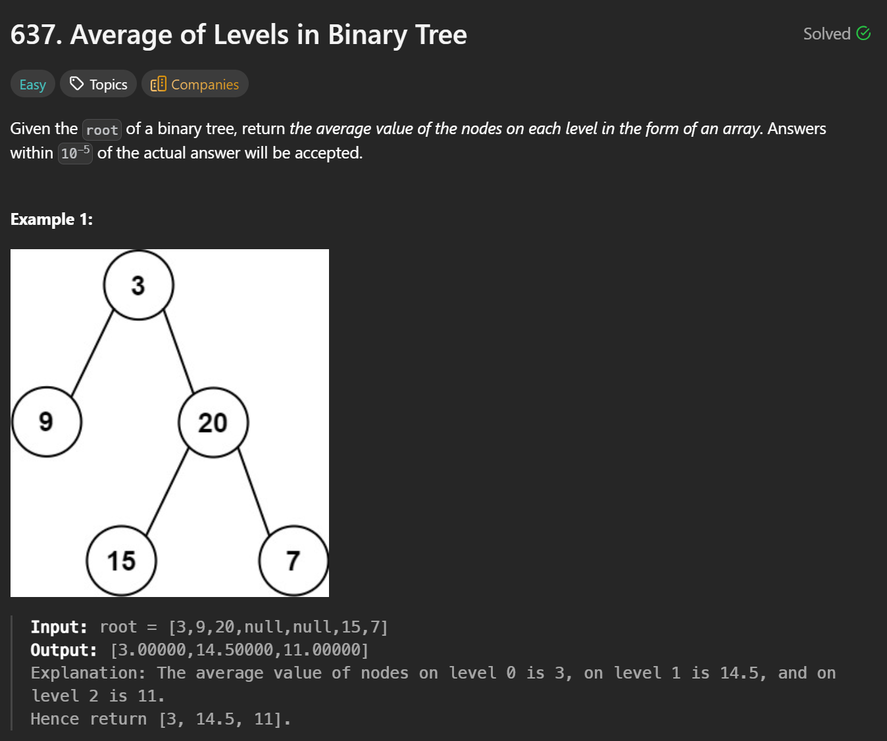
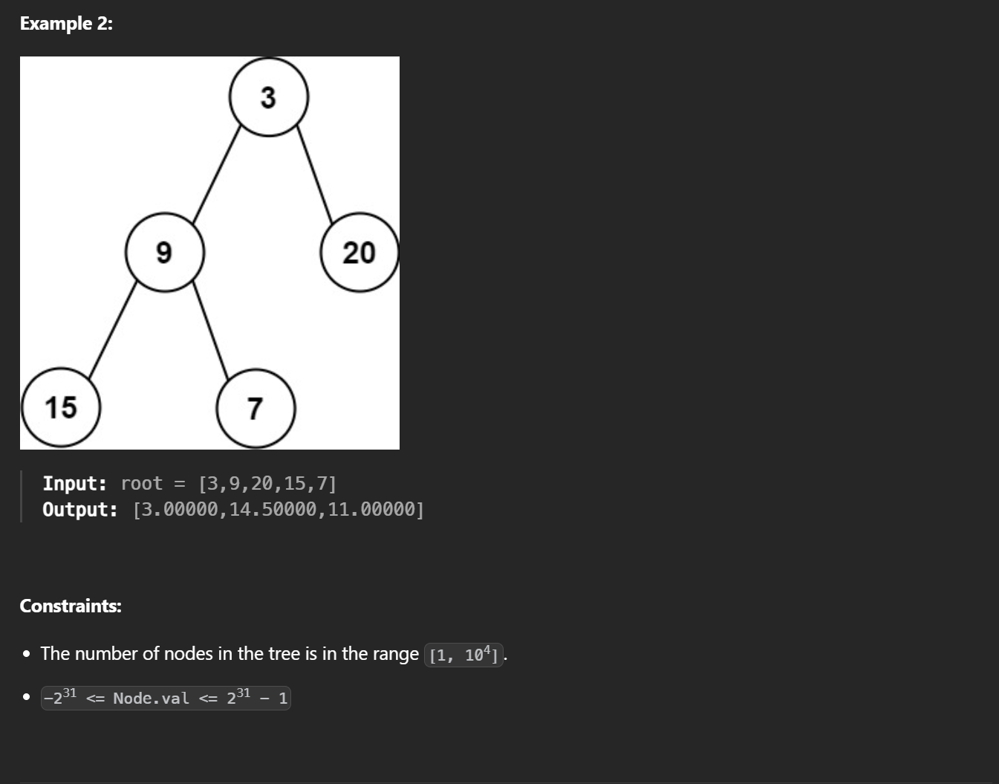

```cpp
/**
 * Definition for a binary tree node.
 * struct TreeNode {
 *     int val;
 *     TreeNode *left;
 *     TreeNode *right;
 *     TreeNode() : val(0), left(nullptr), right(nullptr) {}
 *     TreeNode(int x) : val(x), left(nullptr), right(nullptr) {}
 *     TreeNode(int x, TreeNode *left, TreeNode *right) : val(x), left(left), right(right) {}
 * };
 */
class Solution {
public:
    vector<double> averageOfLevels(TreeNode* root) {
        vector<double> res;
        queue<TreeNode*> q;
        q.push(root);

        while(!q.empty()) {
            int size = q.size();
            double total = 0;
            for(int i = 0; i < size; i++) {
                TreeNode* node = q.front();
                q.pop();

                total += node->val;
                if(node->left) q.push(node->left);
                if(node->right) q.push(node->right);
            }
            res.push_back(total / size);
        }
        
        return res;
    }
};
```
 ---
**Time Complexity: O(n)  
Space Complexity: O(w)**