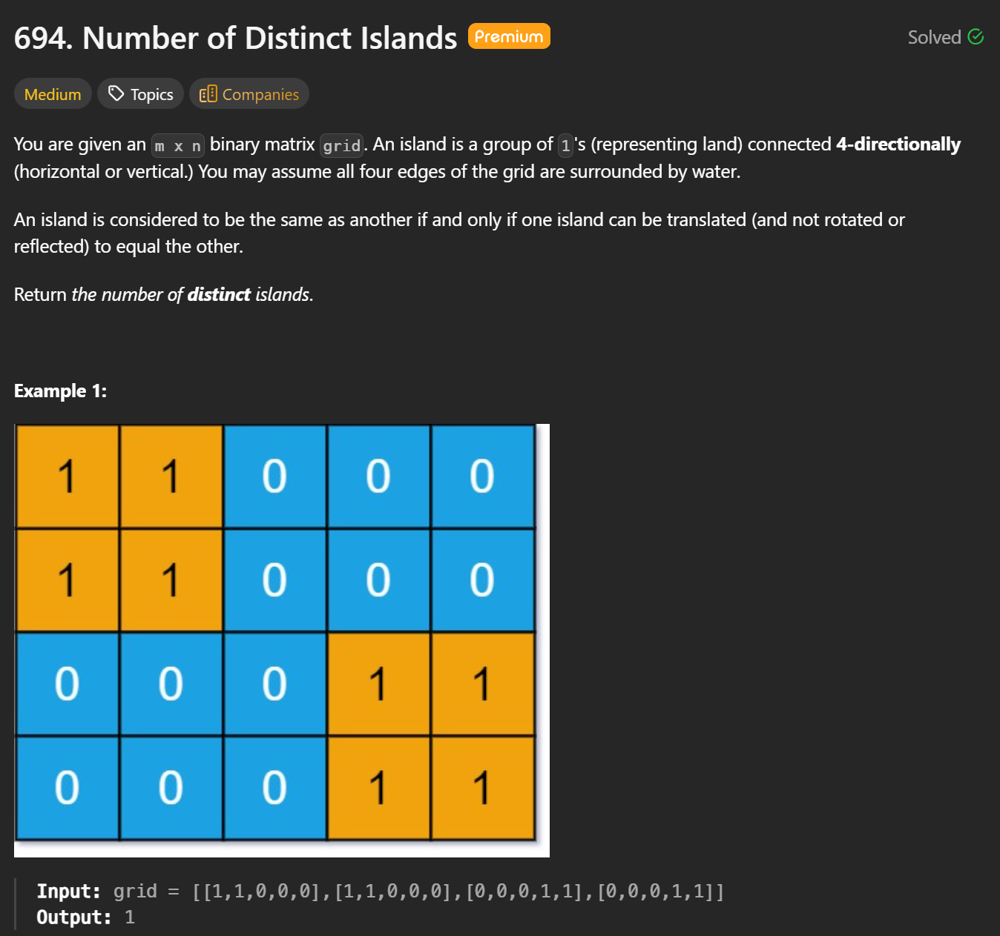
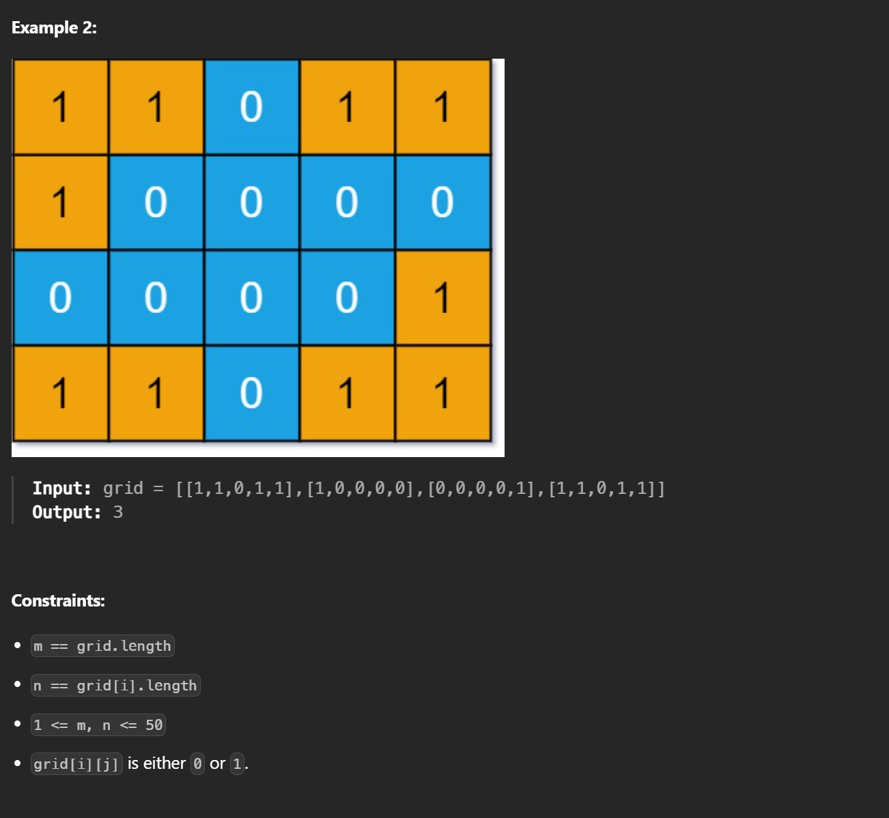

```cpp
class Solution {
public:
    int numDistinctIslands(vector<vector<int>>& grid) {
        int m = grid.size();
        int n = grid[0].size();
        string path;
        unordered_set<string> set;

        function<void(int, int, char)> backtrack = [&](int i, int j, char dir) {
            if(i < 0 || j < 0 || i >= m || j >= n || grid[i][j] != 1) return;
            
            grid[i][j] = 0;
            path.push_back(dir);

            backtrack(i - 1, j, 'u');
            backtrack(i + 1, j, 'd');
            backtrack(i, j - 1, 'l');
            backtrack(i, j + 1, 'r');

            path.push_back('0');

        };

        for(int i = 0; i < m; i++) {
            for(int j = 0; j < n; j++) {
                if(grid[i][j] == 1) {
                    path.clear();
                    backtrack(i, j, '0');
                    set.insert(path);
                }
            }
        }
        return set.size();
    }
};
```
**Time: O(M*N)**     
**Space: O(M*N)**