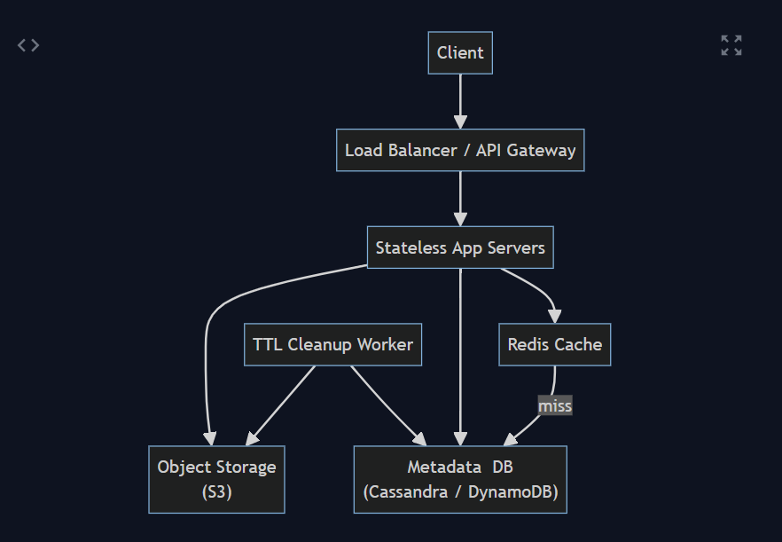

# Design Pastebin

## System requirements

---

## Functional:

Create and Share Pastes.  
Plain Text Only.  
Optional Expiration.  
No Accounts Needed.  
Unique URL/ID Generation​.  

(Note: Features like editing or deleting pastes, custom URLs, user-specific paste listing, or content search are out of scope for the MVP, but could be considered later.)

---

## Non-Functional:

High Availability: The service should be highly available and reliable​.  
Durability: Once a paste is stored, it should not be lost before its expiration​.  
Low Latency: Paste creation and retrieval should be fast.  
Scalability: The design should scale to millions of users and a high volume of pastes.  
Consistency: For this use-case, strong consistency is desired for paste data – once a paste is created and a user receives the URL, any attempt to retrieve that paste (by that URL) should reflect the content immediately​. In practice, this means after a successful paste creation response, any read should find the new paste. (Eventual consistency might be acceptable for some back-end replication, but the user experience requires that new pastes be quickly available for reads.)

---

## Capacity estimation

### Traffic (Writes)

Suppose we anticipate on the order of 1 million new pastes per day. This is about ~12 paste creation requests per second on average​. Traffic will not be uniform; at peak times we might see perhaps 10x the average load (hundreds of writes per second during spikes). We assume each paste is created once (no updates).

---

### Traffic (Reads)

The system is read-heavy​. Each paste may be read many times after creation. A read-to-write ratio of around 5:1 or higher is reasonable (many references assume between 5× and 10× more reads than writes)​. For example, if we have 1M new pastes/day, we might see ~5–10 million paste retrievals per day. This comes out to roughly 60–120 read requests per second on average, and potentially bursts of thousands of reads per second at peak if a particular paste goes viral​. In a more extreme scenario (100:1 read/write ratio​), read traffic could reach ~100M/day (~1200 reads/s), so our design should be prepared for high read throughput.

---

### Data Size per Paste

We must decide on maximum and average paste sizes. To prevent abuse, we can cap the size of a paste (for example, maximum 1 MB or 5–10 MB of text)​. Realistically, many pastes are much smaller (snippets of code or logs). Let’s assume an average paste size ~10 KB​ (some may be just a few hundred bytes, some could be larger, but 10 KB is a typical order of magnitude​).

---

### Storage (Daily & Total)

At 1M pastes/day * 10 KB each, that’s about ~10 GB of new data per day that needs to be stored​. Over longer periods:

- In one month (~30 days): ~300 GB of data.
- In one year: ~3.6 TB of data.
- In five years: ~18 TB of data​.

These figures assume we retain everything indefinitely. If we implement expirations, the actual stored data would depend on how long pastes live. For instance, if we only retain data for 3 months (90 days), we’d store roughly the last ~900 GB of pastes at any given time​. Given millions of users, we should design for multiple terabytes of storage in the long run.

---

### Total Number of Pastes

Over five years at 1M pastes/day, we could accumulate about 1.8–2 billion paste entries​ (if none expired). Even with expirations, the database could contain on the order of hundreds of millions of records. This impacts how we choose our data store and how we generate unique keys (IDs).

---

### ID Space and Collision

We need a strategy to generate unique paste IDs that won’t run out. If we use an alphanumeric ID of length 6 (using 62 characters [0-9, a-z, A-Z]), we have  
62^6 ≈ 56 billion possible IDs. This is plenty for our needs (e.g. 2 billion IDs used is only ~3.6% of that space). Using base64 (64 characters) with 6 characters gives ~68.7 billion possibilities​. Even in the distant future with tens of billions of pastes, 6-character IDs suffice. We can always extend to 7 characters (62^7 = 3.5 trillion combos) if needed. The probability of random ID collisions with 56+ billion possibilities is very low for our usage, but we will still handle collision cases just in case (see Key Generation in detailed design).

These estimations guide our design: we need a system that can handle tens of writes per second, hundreds to thousands of reads per second, and store terabytes of data over time. The design should support scaling out horizontally as these numbers grow.

---

## API design

Create Paste – POST /paste  

Retrieve Paste – GET /paste/{id}  

Delete Paste – DELETE /paste/{id} (optional)

---

## Database design

The data model for a paste is simple. Each paste is essentially a small document with an ID as the key. We can separate metadata (ID, timestamps, etc.) from the actual content for efficiency. The design will include:

---

### Paste Metadata

This will be stored in a fast, persistent database keyed by the paste ID (which is the unique URL token).

- PasteID (Key): The unique identifier (e.g. “abc123”). This is the primary key used to look up the paste. It’s a short string (length ~6-8). All pasteIDs are unique; we can enforce this with a primary key or unique index​.
- ContentPointer: Instead of storing the full text content in the primary database, we store a pointer or reference to where the content is stored. For instance, if we use an object storage service (like AWS S3) to hold the paste text, this could be an object key or URL​​. Another approach is to store the content directly if it’s small – but given content can be up to megabytes, using external storage is more scalable (see below).
- CreationTime: Timestamp of when the paste was created (or stored)​.
- ExpirationTime: Timestamp of when the paste is set to expire (optional; null or a special value if the paste doesn’t expire)​. This allows us to implement TTL logic – we know after this time the paste is invalid and can be purged.

We can represent the Paste metadata table as follows:

- id: Unique paste identifier (e.g. “abc123”). Primary key for lookup.
- content_ref: Reference to stored content (e.g. an object store key or file path).
- created_at: Timestamp when the paste was created.
- expires_at: Timestamp when the paste will expire (nullable if no expiration).
- size: Size of the paste content in bytes (for informational or optimization use).

Since we have no user accounts, we don’t need a user ID in this table. Each paste stands on its own.

---

### Paste Content Storage

For storing the actual text content, a common pattern (given potentially large volumes of text) is to use an object storage or blob storage service. The idea is to offload the heavy lifting of storing and serving large text blobs to a system designed for it​​. Options include cloud storage like Amazon S3, Google Cloud Storage, or a distributed file system. The metadata table will store a reference (e.g. an S3 key or URL) to the content.

If the paste is small (say under some threshold like 1-2 KB), we could consider storing it directly in the database record (to save an extra lookup). But for simplicity and consistency, we can store all content in the object store and keep only references in the DB. This also keeps the database size smaller (only ~hundreds of bytes per paste record for metadata, instead of potentially kilobytes)​.

Each paste’s content object can be named by the paste ID (for instance, we could use the pasteID as the filename in S3)​. This makes retrieval straightforward: if you have the ID, you can directly fetch the object from storage.

Storing content externally provides unlimited scalability and durability – object stores can handle billions of objects and large data volumes cheaply​. It also allows independent scaling of storage and database: our DB handles small records (ID->pointer), while the heavy data is on a storage service that can scale out separately​.

We should ensure the object store has proper replication and backup, or if self-hosted, that we replicate files to avoid data loss​. Cloud object stores typically handle replication automatically across multiple availability zones.

---

### Why not store content directly in the database?

Storing everything in one SQL or NoSQL database is simpler initially, but it can become a bottleneck:

- Large text blobs can slow down database queries and replication. By separating content, the DB only handles keys and small metadata (fast to query).
- Using an object store means we can serve content directly to users (possibly via CDN) without always going through our application servers, improving read throughput (more on this in High-level Design).
- Object stores are optimized for high-throughput, streaming large data, and cost-effective storage (often cheaper per GB than database storage)​.

---

### Database Choice

We need to pick a database for the metadata. Key considerations:

- We will have on the order of billions of records over time, with a simple key->value access pattern (no complex relationships or joins)​.
- We require high write and read throughput, and the ability to scale horizontally.
- A NoSQL key-value store or wide-column store is a natural fit. For example, Amazon DynamoDB (a hosted key-value store) or Apache Cassandra (a distributed wide-column DB) are designed for this kind of workload (billions of keys, high read/write rates)​. They also natively support partitioning and replication.
- A relational database (SQL) could be used for the metadata (with id as primary key). It provides strong consistency and ease of querying, but scaling to billions of rows might require sharding or federation. It’s feasible (companies do shard MySQL/Postgres for large data), but adds complexity. Since our access pattern is simple and mostly primary-key lookups, a NoSQL store can give scalability with less management overhead​.
- We can also consider the consistency needs. DynamoDB or Cassandra are typically eventually-consistent by default, but can be configured for strong consistency on reads/writes if needed. A relational DB would give strong consistency by default (reads from master) but might trade off availability in a partition. Given our requirement that newly created pastes be immediately available, we will ensure whichever DB we choose can satisfy that (e.g. perform reads at consistency level that ensures latest data).

Alternatively, DynamoDB (if using AWS) could be used with a similar data model​. DynamoDB can handle a very high scale of requests and also has a TTL feature for items. Both choices meet our needs; we’ll proceed with the concept (the design is similar either way).

---

### Search Indices

Our primary access pattern is by ID (exact lookup), which is the primary key. That lookup will be O(1) or O(log N) depending on the DB, but essentially very fast via hashing. We should also consider an index on the expires_at field if we want to efficiently query for expired records for cleanup. In Cassandra, one might use a time-series table or a separate mechanism for expiration, but since TTL will handle automatic expiration, we may not need a secondary index. If using a system without TTL, we might need a scheduled job to find expired pastes (e.g. scanning by time or keeping a sorted set of expiring IDs).

---

### Summary

Each paste operation will result in:

- An object stored (the text content in blob storage).
- A metadata entry in the database (with key and metadata).

This separation allows us to scale and manage the two concerns (metadata vs content) independently​. The metadata DB remains lean and efficient for queries, and the object store handles large data storage with high durability.

---

## High-level design

At a high level, our Pastebin like service follows a standard web service architecture with decoupled components to achieve scalability and reliability. The major components include:

---

### Clients

End-users or applications that send requests to create or read pastes. This could be a web browser (visiting a website or using a web form) or any HTTP client using the API.

---

### Load Balancer (LB)

Distributes incoming HTTP requests across multiple application servers​. The LB ensures no single server is overwhelmed and enables horizontal scaling. It also health-checks servers and stops sending traffic to any that are down.

---

### Application Servers

These run the core application logic (the Pastebin service). They handle HTTP requests for creating or retrieving pastes. We can design them as stateless web servers (e.g. Node.js, Python Flask/FastAPI, Java Spring, Go, etc.) so they can be easily scaled out. We might logically separate Write operations and Read operations for clarity or even deploy them as separate services (since the read path can be optimized separately from the write path)​. However, they could also be unified in one codebase. Each app server will:

- On POST /paste: validate input, call the ID generator, store the paste (content + metadata), and return the URL.
- On GET /paste/{id}: lookup the paste’s content (possibly via cache and DB/storage), and return it.

These servers will interact with the database, cache, and storage as needed.

---

### ID Generation Service

A specialized service or component responsible for generating unique IDs for new pastes​. We mention it separately because ensuring uniqueness and avoiding collisions at scale can be non-trivial. The ID generator could be implemented as an internal library (generating random IDs and checking the DB) or a dedicated microservice (e.g. a Key Generation Service (KGS) that doles out unique keys)​. We will detail this in the component design, but at a high level, this service ensures each paste gets a unique short ID and that we can generate them at a high rate without conflicts.

---

### Metadata Database

The database cluster storing paste metadata (as designed in section 4). This is typically a distributed NoSQL store like Cassandra or DynamoDB. It holds entries mapping paste IDs to content references and metadata. It is designed to handle a huge number of records and many requests per second. We will configure it with replication for fault-tolerance and possibly sharding/partitioning by ID (which is usually automatic in Cassandra/Dynamo)​.

---

### Object Storage Service

This stores the actual paste text content (blob data). For instance, an AWS S3 bucket or a distributed file store holds files named by paste IDs. This service is highly durable (e.g. S3 redundantly stores data across facilities)​. The application servers will store to and read from this storage when handling pastes. To improve performance, we might integrate a CDN in front of the object storage for reads (so content can be cached closer to users).

---

### Cache Layer

A distributed in-memory cache (Redis) to cache frequently accessed data​. We can use the cache to store recently created pastes and frequently read pastes. The cache is typically keyed by paste ID and stores the content (and possibly metadata) as value. This significantly reduces read latency and load on the database for hot keys. The cache cluster can be scaled and should also be replicated (or use clustering) to avoid it being a single point of failure.

---

### Background Job Scheduler

A component (or cron job) for maintenance tasks. Specifically, a scheduled job will periodically scan for expired pastes and delete them from the system​. If we rely on DB TTL, this job may not be heavily needed for DB cleanup, but it might still handle removal from object storage (e.g. deleting S3 objects for expired pastes, if not automated) and cache invalidation. This scheduler could also handle other tasks like generating usage analytics, or pre-computing any stats if needed.

## Request flows

---

## Write path

A user submits a POST /paste containing the text and an optional expiry time. The load-balancer forwards the call to any stateless write-server. The server validates size, asks its local ID-generator (or retries random generation until unique) for a six-character token such as abc123, streams the text into object storage under that key, then records a metadata row (id, content_ref, created_at, expires_at) in the distributed database. If either step fails the operation is rolled back. Finally it primes the Redis cache with the content and TTL matching the expiry and returns https://…/paste/abc123 to the client—total latency tens of ms.

---

## Read path

A browser or script issues GET /paste/abc123. The request lands on a read-server, which first looks in Redis; a hit returns the text in a few ms. On a miss it loads the metadata row (O(1) key lookup); if the record is absent or expires_at is in the past it responds 404/410. Otherwise it fetches the blob from object storage, streams it to the client, stores the text in Redis with the residual TTL, and finishes. Subsequent reads are memory-speed; a CDN in front of the object store can off-load bandwidth for viral pastes.

---

## Expiry and cleanup

Each row is written with a database TTL, and each object is tagged with an S3 lifecycle expiry. A periodic job merely evicts any lingering cache entries and double-checks that both DB row and blob have disappeared, keeping storage use bounded.

This condensed flow shows how the load-balancer, stateless servers, Redis, the database and object storage cooperate to give fast, collision-free writes, sub-millisecond cache hits, and automatic expiry without manual intervention.

---

## Detailed component design

Now, let’s dive deeper into each major component, discussing how they are implemented and how we ensure they meet our requirements.

---

## Application Servers (Write & Read Services)

The application layer can be designed as a stateless, horizontally scalable tier. We can run many instances (on VMs or containers) behind the load balancer. Because they are stateless, any instance can handle any request, which simplifies scaling and failover.

---

### Separation of Concerns

We might logically separate the write path and read path handlers. They could be different endpoints on the same service, or even split into two deployable services if we want to scale them independently. For instance, if reads become 100x more frequent than writes, we might allocate more servers to running the read handler. In microservices style, we could have a Write Service and a Read Service, each with its own autoscaling policy. However, initially it might be simpler to have one service that does both, and scale it out as a whole.

---

### ID Generation Integration

When a write server needs a new ID, how does it get it? A few design options:

Database-unique ID: Use an atomic counter or a sequence in a database (SQL AUTO_INCREMENT or a separate table for IDs). This centralizes ID generation but can become a bottleneck at scale (every new paste hits one sequence). Also, sequential IDs are predictable.

Random generation with check: The server can generate a random 6-character string (using a secure random source) and attempt to insert the metadata record with that ID. If the insert succeeds, great. If it fails due to duplicate, try again with a new random string​. Given the huge key space (56 billion combos) and relatively low creation rate, collisions are extremely rare (expected collisions start to be an issue only when used IDs count is square of space size, which is far beyond our usage). This approach is simple and distributed (each server can do it independently). The downside is a theoretical chance of a retry and slightly more DB work on collision (which is infrequent).

Pre-generating IDs (Key Generation Service): Maintain a dedicated service that generates batches of unique IDs in advance and stores them (e.g. in a separate keys DB or in memory). Application servers can request an unused ID from this service each time. This guarantees uniqueness without retry logic at the expense of an extra network call and complexity of the KGS. We must ensure the KGS itself is highly available (replicated) so it’s not a single point of failure​. We can also have each app server cache a batch of IDs from the KGS so it doesn’t call it on every request (e.g. grab 1000 IDs at once)​. If a server crashes with unused IDs, it’s fine (they’ll just never be used, which is acceptable given the key space)​.

For simplicity and given our moderate write QPS (~12/s), we can start with the random-and-check approach, which doesn’t require a separate service. We enforce uniqueness via the DB’s primary key and handle the rare collision by retrying. If down the line the collision rate or performance becomes an issue, we could introduce a more elaborate KGS.

The IDs we generate will be unpredictable (random), fulfilling the security requirement that links aren’t guessable​. We should use a sufficiently random method (not something like incremental or user-provided without checks).

If we support custom aliases from the user: the app server will skip ID generation and use the provided alias, but first check in the DB if it’s free (a simple read by that key). If it exists, return an error (or suggest an alternative). We might reserve certain aliases or apply rules (like minimum length, etc.)​ to prevent abuse.

---

### Data storage calls

The app server will interact with the DB and object storage. We should use efficient clients:

For the database (Cassandra/Dynamo), use a connection pool or client library that handles cluster communication. Writes and reads should be as local as possible (e.g. connect to the correct replica if needed).

For S3 or object store, use the provided SDK which can handle retries and parallel uploads if needed (though for 10KB text, a single PUT is fine).

If using a SQL database, use parameterized queries or an ORM for inserts/select by primary key.

---

### Caching

Each app server will also interface with the cache:

Use a Redis client library to get/put cache entries.

We need to design cache key structure; simplest is the paste ID itself as the key (since that’s unique in global namespace).

On a read miss, after fetching from DB and storage, the server should set the cache: SET id -> content (EX seconds_till_expiry). On writes, we might do an add: SET id -> content so that an immediate subsequent read finds it.

We should also consider cache eviction strategy: we don’t want to cache extremely large pastes (could evict many small ones). But since max is 1MB and average is 10KB, it’s fine. We rely on LRU in Redis to evict less-used entries if memory is full.

---

### Statelessness and Scaling

Because all state (pastes) is in the DB/storage and cache, the app servers don’t hold any persistent state between requests. This means we can scale out by just adding more servers behind the LB. If one server fails mid-request, the request fails but the client can retry and another server can handle it. For sticky scenarios like maintaining a batch of IDs, each server may have some cached IDs, but losing them is not critical aside from a tiny performance hit.

---

### Autoscaling

We can set up the infrastructure to monitor CPU, memory, or request rate on the app servers and automatically launch more instances during high load. Because of the LB, new instances can start receiving traffic as soon as they’re up. Similarly, in low load, some instances can be shut down. This elasticity ensures we handle millions of users at peak but don’t waste resources at off-peak​.

---

## Database (Metadata Store)

We choose a NoSQL distributed database (like Cassandra) for metadata, as justified. Here’s how we configure and use it:

---

### Cluster Setup

The DB will run on multiple nodes (servers). For example, if we have 6 nodes, Cassandra will partition the key range among them. Each paste ID, when hashed, maps to a token that determines the node responsible​. Data is replicated to (say) 3 nodes for fault tolerance. This means any given piece of data resides on 3 nodes (RF=3), and the cluster can tolerate up to 2 node failures without data loss.

---

### Keyspace and Table

We create a keyspace (namespace) in Cassandra for our service, and within it a table for Pastes with columns as per our schema. The primary key is the id. In CQL, it might look like:

```sql
CREATE TABLE Pastes (
    id TEXT PRIMARY KEY,
    content_ref TEXT,
    created_at TIMESTAMP,
    expires_at TIMESTAMP
);
```

We might also include content_size or other fields as needed. If we plan to support user accounts in the future, we could add a user_id to link to a User table (but that would complicate the key since no accounts now, we skip it).

---
### Access Patterns

Write (Insert): a simple insert by key on paste creation. Cassandra is efficient at writes; it will log the write and store it in memory (memtable) to flush later. We might set consistency level to QUORUM or ALL for writes to ensure the data is on multiple replicas before acknowledging (for durability). If we use DynamoDB, we simply do a PutItem.

Read (Select by key): also straightforward; we do SELECT * FROM Pastes WHERE id = ?. This hits the nodes that have the key’s partition. If consistency is ONE or QUORUM, one replica’s result is returned. We likely want strong read consistency for newly written data: we can either do a QUORUM read, or in Cassandra, do a ONE read under the assumption that the client hitting the same region will get the local replica which likely has it (if replication is across racks rather than distant data centers). In Dynamo, we can specify strongly consistent read option for that request if needed.

TTL: We can set a TTL on each record equal to the expiration interval (Cassandra allows specifying TTL on insertion). If a paste is set to expire in 1 day, we insert with TTL=86400 seconds. After that time, the record will be purged automatically. We still need to handle the content blob separately (maybe via S3 lifecycle or our own job). If no expiration (like “never”), we either set no TTL or a very long TTL (e.g. 5 years or none at all).

Partitioning & Load Distribution

Because our keys (IDs) are essentially random strings (especially if generated by a good random process), they will naturally distribute evenly across partitions. This avoids hotspots (unlike a sequence, where recent IDs all go to one shard, here “abc123” and next “qwe456” will likely hash to different nodes). This uniform distribution is great for scaling. We just have to ensure the partitioner (like Murmur3 in Cassandra) spreads keys well, which it does for random input.

---

### Scaling the DB

If our usage grows (say to 10M writes/day and hundreds of millions of active records), we can add nodes to the Cassandra cluster. Thanks to consistent hashing, data rebalances with minimal impact. In Dynamo, we’d request a higher throughput from AWS. The important point is that this DB design can scale horizontally without a major redesign (in contrast, a single MySQL instance would start struggling, forcing a sharded MySQL approach).

Durability & Backups

We will configure multi-datacenter or at least multi-AZ replication for resilience. Also, periodic snapshots or backup of the data (in case of catastrophic failure beyond 2 nodes) should be done. If using Dynamo, AWS handles backup with point-in-time recovery.

Alternative

If we had chosen a relational DB, we would likely have to partition it ourselves by range or hash of id. We’d also set up replicas for reads. It can be done, but NoSQL simplifies it here. Moreover, no complex query (like no JOIN or scanning by user, etc.) is needed, so we don’t lose much by not having SQL relations.

---

### Object Storage (Content Store)

We decide to use an external object storage service for paste content:

For example, AWS S3 bucket named “pastes” can store objects where each object’s key is the paste ID (or we could use a folder structure if needed, e.g. partition by first 2 chars, but S3 handles large number of objects fine nowadays).

When a paste is created, we do an S3 PUT request with key = pasteID, content = text blob. We might also set metadata on the object, such as an HTTP header for expiration date (for S3’s lifecycle policy).

We enable a lifecycle rule on the bucket: any object with an expiration tag or older than X gets deleted. Alternatively, set each object’s Expiry property individually if possible. This way, when a paste expires, S3 will automatically remove the content after some time (usually S3 lifecycle is not to-the-second precise, but within a day of expiration it will remove).

On retrieval, we have two approaches:

Proxy through our app: The app server gets the object (using S3 GET via SDK) and streams it to the user. This gives us control (we can apply transformations or logging). The downside is our server’s bandwidth is used for the entire download.

Redirect to S3: The app server could generate a signed URL to the object (S3 allows generating a time-limited URL that anyone can fetch) and return an HTTP redirect to that URL. Then the client will directly download from S3. This offloads bandwidth to S3 and can be faster if S3 has better throughput. However, it exposes the raw storage URL (which might be fine; with short expiration on the signed URL, it’s not a security risk).

We could also front the S3 bucket with a CDN like CloudFront, so a user fetching content goes from nearest edge location. For initial simplicity, we can just fetch via our server or use basic redirect. As traffic grows, offloading to CDN is recommended to keep latency low for global users and reduce load on our servers.

Capacity

S3 can handle essentially unlimited data, so storing 18+ TB over years is fine. We just pay for what we use. It’s also highly durable (99.999999999% durability) meaning it’s practically impossible to lose data once stored. That aligns with our durability requirement.

---
### Data format

We are storing plain text. We should ensure to set the correct content-type (text/plain; charset=utf-8) so that if the content is fetched via web or CDN, it’s served correctly. We might also compress the content (text compresses well). S3 can store gzipped content and we could mark it as such. But since pastes are not huge, compression is optional. It could save bandwidth if a lot of large texts are served.

### Multi-region

If we deploy our service in multiple regions, we could either use separate buckets (one per region) or an S3 replication. But that’s an advanced scenario – by default, we might keep all data in one region’s bucket. A CDN would mitigate cross-region access issues.

### Cache (Redis)

We use Redis as an in-memory cache to speed up reads. The design considerations:

### Deployment

A Redis cluster of multiple nodes (to have more memory and also avoid single point of failure). We could use Redis with replication (master-slave) and partitioning (sharding keys across nodes). There are also managed services like AWS ElastiCache. For simplicity, assume we have a few Redis nodes and a consistent hashing or cluster mode to distribute keys.

What we cache

Primarily the paste content (the text) indexed by the paste ID. We might also cache the fact that a paste ID is expired or not found (to prevent hitting DB repeatedly for a non-existent ID). This is known as caching negative results. We could store a marker like id -> NULL with a short TTL if a paste wasn’t found, so that subsequent requests in a short time don’t slam the DB. But careful with that: if a paste is just created, we don’t want a cached “not found” to persist. So maybe small TTL (a minute) for negatives.

### Expiration

We set the cache entry to expire at the same time as the paste. Redis supports setting an absolute TTL on key. For example, if a paste will expire in 2 hours, we set the cache to evict it in 2 hours as well. If the paste never expires, we could set a long TTL (or no TTL, relying on LRU eviction). But in theory “never” could overload memory, so we might set some upper bound TTL like 30 days and it will be refreshed if accessed often.

Write-through vs Lazy population

We will do a bit of both:

On a paste create, we can proactively cache the content (write-through cache).

On a read miss, we fetch from DB/storage and then populate the cache (lazy fill).

If a paste is rarely read, it might evict before next read, which is fine.

### Cache Size

If we allocate, say, 10 GB to cache, that can hold ~1 million entries of 10KB each. If our daily active set of pastes (that are being read) is in that ballpark, cache will be effective. We assume a Zipf-like distribution where some pastes get a lot of hits (those will stay in cache due to frequency).

### Eviction policy

Use LRU or LFU (least recently/frequently used) so that unused pastes get evicted to make room for currently hot ones. Redis by default has LRU.

### Consistency considerations

Since we store data also in DB, we have to ensure if data changes, cache updates. In our system, data is immutable after creation (no updates to content), and deletion/expiry we handle by TTL. So consistency is easy – once cached, content doesn’t change. The only consistency issue is serving an expired paste from cache. By aligning TTLs, we avoid that. Also on deletion, the deletion job should delete from cache if it finds an entry. So our cache consistency with the source data is manageable.

### Failure scenario

If the cache cluster goes down or is flushed, the system will still work (just every request goes to DB/storage, with higher latency). It’s not catastrophic, just less optimal. We should monitor cache health and maybe have redundant caching if needed (but usually not required since loss just means recalculation).

## ID Generation Service

If we implement a dedicated ID generation service (KGS), details would include:

Maintain a database of unused IDs or an algorithm for generating unique IDs sequentially.

Could be a simple service that holds a counter and converts it to base62 string. For example, ID 1 -> "aaaaaa", 2 -> "aaaaar", etc. But sequential IDs are predictable, which we wanted to avoid. We could add a random salt or shuffle to make them non-sequential.

Alternatively, generate random IDs and keep track of those given out (to avoid reusing if not inserted). This is almost like doing the DB insert logic in another place.

The KGS could pre-generate a pool of IDs and mark them as used when handed out.

It must be multi-instance (so we have a standby or load balanced multiple ID servers) and likely backed by a small database to coordinate (which itself is then a bottleneck if not careful).

Given our earlier decision, we may avoid a separate service to reduce complexity. But if introduced, the KGS database can be something like a MySQL with a table of all possible keys and a pointer – not really feasible to store 56 billion combos explicitly. More practically, KGS can generate by algorithm and just check against used.

## Batching keys

As mentioned, one optimization is each app server requests e.g. 1000 new IDs from KGS at once, and caches them locally.

If we implement this instead of random generation, here’s how it would work:

The KGS could generate IDs by maintaining counters or using algorithms. One robust approach is to use a ticket server with a Snowflake or UUID strategy that produces unique IDs. But for short IDs, a simpler approach is needed.
We might have a table of all used IDs or a bitset. But storing billions of IDs explicitly is heavy. Instead, we can use a counter + base conversion approach to get unique IDs in sequence, but then shuffle them to appear random. E.g., maintain a global counter and encode it in base62, maybe with a per-instance prefix to avoid collisions. However, sequential IDs might be predictable if the attacker learns the scheme.
Another method: Pre-generate a large batch of random IDs offline, sort them, and store in a DB. The KGS then just pops one ID for each request. This ensures uniqueness but requires storing all or a large portion of the keyspace (not very feasible beyond millions).
Given these complexities, we likely stick to on-the-fly random generation with retry for now. But if using KGS, we would run multiple instances of it and ensure it’s backed by a fault-tolerant store. The KGS could be just another service in our architecture diagram that the Write service calls.

## Preventing KGS as a SPOF

We’d replicate the KGS or allow app servers to fall back to random gen if KGS is unavailable. Also caching keys on app nodes helps. Essentially, if KGS fails, the system shouldn’t grind to a halt; we could temporarily allow local generation until KGS is back.

## Load Balancer

Could be an L7 (HTTP) load balancer or simple reverse proxy (like Nginx, HAProxy, or cloud LB service). It needs to handle SSL termination (if we serve over HTTPS), and route to healthy app servers.
Use health checks (ping each app server or test an endpoint) to know if it’s alive.
Ensure sticky sessions are not needed (since stateless), any server can serve any request.
For scaling, the LB itself could be redundant (e.g. multiple LBs with DNS round-robin, or a managed LB service that’s HA).
Possibly include an API Gateway if we want to enforce rate limits or API keys per user, but in MVP we keep it simple.

## Monitoring & Logging

Not explicitly asked, but in any large system:

We’d have monitoring on all components: CPU, memory of servers, DB latency, cache hits/misses, storage errors.
Set up alerts for high error rates (e.g. if a DB node goes down, we should see it).
Logging every request (with ID, timings) to analyze usage patterns or debug issues.

These support maintainability and operations of the system at scale.

## Trade offs/Tech choices

Throughout the design, we made certain decisions. Here we discuss trade-offs and alternatives considered, justifying why we chose one approach over others:

## SQL vs NoSQL for Metadata

We chose a NoSQL key-value store (like Cassandra) over a SQL database.

SQL (like MySQL) would give strong consistency and ACID guarantees easily, and can be simpler for developers used to relational schema. However, at the scale of billions of records and high throughput, a single SQL instance would not suffice; we’d need sharding and/or replication, which adds complexity. NoSQL (Cassandra/DynamoDB) is built to scale horizontally with minimal effort and can handle our access pattern (simple PK lookups) efficientl】. We traded some convenience of SQL and maybe complex query ability for the scalability and performance of NoSQL. We also accept eventual consistency in some NoSQL systems, but we can configure for near-strong consistency in this use case (reads and writes to quorum). DynamoDB offers strong consistency per request if needed, Cassandra’s eventual consistency is usually fine for our scenario since we don’t do multi-step transactions. Conclusion: The choice prioritizes horizontal scalability and write throughput (NoSQL) over strict relational features.

## Strong Consistency vs Availability

According to the CAP theorem, in a distributed system we often trade consistency for availability. Our system emphasizes that once a paste is created and confirmed, any read after that should get it (consistency). But in a network partition, what do we prefer? If using Cassandra, we can choose consistency levels. We might choose availability (AP) by serving stale data if needed (though stale in our case mostly means missing newly created paste if a partition prevents seeing it). However, missing data might be considered as downtime for that paste. Given the nature of pastebin, it’s likely acceptable to be eventually consistent for a very brief window (user likely not sharing the link the microsecond after creation). Some designs explicitly mention eventual consistency is okay because the link isn’t used immediatel】. But realistically, the user might create and then click the link right away. We ensure our process makes it consistent by the time they get the link (since we waited for DB commit).

If a replica is slow and a read goes to a replica that didn’t get the write yet (in eventual system), that user might see a 404 even though paste was just created. To avoid that, we might do reads with consistency of read-your-writes for at least a short time (maybe by routing the read to the same node that handled the write, via sticky routing or by using consistency protocols).
We likely lean toward CP (Consistency, Partition tolerance) in the moment of creation (ensuring any successful write is visible to reads). For general reads, being slightly AP is fine if a node is down but others still serve data (even if maybe a tiny fraction of very recent data missing).
In summary, we design for high availability but try not to sacrifice user-perceived consistency on fresh data. Using DynamoDB or Cassandra with proper settings can achieve this mix (Dynamo strongly consistent reads on new data, Cassandra CL=QUORUM).
There’s also a trade-off on durability vs latency for writes: waiting for multiple replicas (CL=QUORUM or ALL) means higher latency but safer storage. We might use QUORUM for a balance (still available if one node down, and relatively fast).

## Object Store vs Storing in DB

We opted to store content in an object store rather than directly in the DB.

Keeping everything in one database (e.g. using a blob column in a SQL DB or storing text in Cassandra value) simplifies architecture (fewer moving parts). But the database would then handle a lot more data and I/O, which can slow down queries and make scaling harder. Object stores are optimized for heavy I/O and are cheaper for large data. We trade some complexity (we now have to manage two storage systems and the reference between them) for a big win in scalability and cost. It also simplifies DB replication (since it’s not replicating huge blobs). The object store approach slightly increases read latency (two calls instead of one), but caching and possible direct serving mitigate that. So we prioritize scalability of storage and throughput by using object storage, at the cost of system complexity (two datastores and eventual consistency between them if not careful). Given our scale, that trade-off is justified.

## Cache Aside vs Write-through

We are using a cache in front of DB/storage primarily in a cache-aside pattern (the application populates cache on demand. We also do a bit of write-through (populating on new paste).

A pure cache-aside means first read is always a miss and hits DB, subsequent are fast. Write-through means even the first read could be fast, but it adds overhead on write path (every write goes to cache too, even if no one reads it). We chose a combination: write-through newly created content because it’s cheap to do and likely beneficial, but otherwise rely on cache-aside for other content. This gives a good balance of not overwhelming the cache with every single paste (many might never be read even once), but ensuring popular content is cached. The trade-off here is minimal; it’s an optimization detail. Also, we must accept that after a restart of cache or cold start, the initial requests will populate cache (slightly slower), which is okay.

## Generating IDs (Random vs Central Service)

We decided on random generation with collision-check.

This is simple and fast but has a theoretical risk of collisions (which we mitigate by check). The alternative, a central ID service or a deterministic generation, removes collision risk but adds complexity and a potential bottleneck/single point to guard. By going with random IDs, we favor simplicity and decentralization at the cost of a negligible probability of collisions and an eventual need for a more coordinated solution if rate skyrockets. We also avoid sequential IDs which could be guessable. If we had chosen sequential (like a DB sequence), we’d likely need to obscure it. So random is good for security. If our service needed absolutely zero chance of collision without a check, KGS would be needed. We deem the trade (some code to retry on collision) worth it for less infrastructure.

## Single Region vs Multi-Region Deployment

For MVP, we likely deploy in a single region data center (with redundancy across AZs). That means users far from that region might experience higher latency. Multi-region (with data replication across continents) would improve latency and availability (if one region goes down, others still serve). But multi-region replication for both DB and storage complicates consistency. Many pastebin services might just run in one region and rely on CDN for global reads. We choose to keep data in one region (to ensure consistency and simplicity) and possibly use a CDN for global performance. The trade-off is some users get slower response (e.g., an Asia user hitting a US server might see 200ms latency instead of 50ms). For a text fetch, this is usually acceptable. In the future, if user base is truly global and latency sensitive, we can explore multi-region active-active (with a more complex DB setup or multi-master). That would trade more complexity for lower latency and redundancy.


## Using CDN

The choice to use a CDN for content is another trade-off:

If we do use a CDN, we offload traffic and improve speed, but might complicate things like cache invalidation if a paste is deleted (though CDN caches can respect origin no-cache headers or short TTLs).
If we don’t, our servers and storage handle everything. Initially, maybe skip CDN to avoid configuration overhead, trusting our backend and maybe regional replication. But given how easy CDN usage is nowadays, we lean towards using it for the static content (pastes) because it’s a static resource that benefits from CDN. We can set the CDN to treat each paste content as cacheable for a certain time. This is a pro-availability, pro-performance choice with little downside except cost and slight complexity.

## Cassandra vs DynamoDB vs other KV store

Using a managed service like Dynamo might reduce ops burden but ties us to AWS. Cassandra gives freedom and control at cost of managing cluster.

## Failure scenarios/bottlenecks

No system is perfect; let’s analyze how our design handles failures and where the bottlenecks might arise as usage grows:

## Single Points of Failure (SPOFs)

We aim to eliminate SPOFs by redundancy:

The Load Balancer itself can be a SPOF. If using a cloud LB, it’s usually managed to be redundant. If self-managed, we would have at least two in active-passive or DNS-level balancin】. So LB should be highly available.
App Servers: If one goes down, others continue to serve. As long as we have multiple, the service is fine. Autoscaling can replace failed ones. Just ensure if we deploy a new version, do rolling deploy to not drop all at once.
Database: A single database node failure should not bring the service down. With Cassandra (RF=3), any one node can go down and clients can still read/write from other replicas (if consistency level is such that it tolerates one down, e.g., QUORUM in RF=3 can still work with 2). If the entire DB cluster goes down (multi-node failure or network partition), writes/reads fail – the system then cannot fulfill requests (partial availability might remain if some partitions are accessible, but that’s complex). Mitigation: multi-AZ deployment of DB nodes, backup restore procedures, and having monitoring to quickly fix or reroute if an entire cluster segment fails.
Object Store: If using a cloud store like S3, it’s highly redundant by itself (data replicated across facilities). But if S3 service has an outage in a region, our reads/writes for content fail. We could mitigate with multi-region replication or fallback storage. But those are rare and often short. Possibly have a backup store (like if S3 fails, write to a local disk or alternate store temporarily). This is an extreme scenario.
Cache: If the cache cluster goes down, the system still works by hitting DB (at higher latency). So it’s not fatal. We would want to restore it to reduce load though. We can also run multiple cache nodes; if one fails, some keys are lost but others remain accessible (with Redis cluster). With replication, a slave can be promoted to master to avoid downtime.
ID Generation: If we did have a centralized KGS, it must be replicated to avoid being SPO】. Without KGS (random gen), there’s no SPOF for ID generation – each server does it independently.
Network Partition: If network issues happen between components, e.g., app servers cannot reach DB or cache, those operations fail. We should design for timeouts and retries. For example, if a DB write fails due to timeout, maybe try once more or log and inform user to retry. We might return an error "service unavailable" for that operation. Having multi-AZ helps minimize partitions. Also using managed services often ensures they handle internal redundancy.
Entire Data Center outage: If the region goes down, we’re offline unless we have a cross-region failover. For very high availability requirements, we’d have another deployment in a second region and use DNS failover. But that introduces replication complexity. It might be a future improvement. Many paste services might accept the rare downtime if a whole region dies. But ideally, we mention multi-region as future if needed.

## Bottlenecks under Load

Throughput Limits

The app server cluster could become a bottleneck if not enough instances to handle peak RPS (requests per second). For instance, if each server can handle 200 RPS and we get 2000 RPS, we need at least 10 servers. Autoscaling or capacity planning must ensure enough servers. If we under-provision, requests queue or drop.
The database could be a bottleneck if read/write traffic exceeds what the cluster can handle. For example, if not enough nodes or if queries per second (QPS) grows. Solutions: add more nodes (Cassandra scales linearly with nodes up to a point), or use a cache to offload reads (which we do). Also, ensure queries are optimized (we only do key lookups, which is ideal).
The object storage might throttle if we hit extremely high throughput (but services like S3 can handle thousands of requests per second easily; for millions it might need some partitioning by key prefixes which S3 does internally nowadays). If needed, we could use multiple buckets or storage servers. Usually not an issue unless we get to CDN-level traffic.
The network bandwidth might be a bottleneck if our egress is huge (like many users downloading large pastes). If each paste is 1MB and 1000 users download simultaneously, that’s ~1GB outgoing traffic at that moment. Our infrastructure (LB, server NICs) must handle that. Having a CDN helps by caching content at edges.

Latency Issues

If the cache hit rate is low, DB will get more hits, and each read will be slower. We need to size cache properly and possibly pre-warm for popular items. If we find certain keys become hot, we might even consider secondary caches or replication for read heavy ones.
Long tail latency: some requests might be slow if they trigger a large object fetch or if a certain partition in DB is slow (e.g. garbage collection pause in a node). We mitigate by parallelism (Cassandra driver might query two replicas if one is slow – called speculative retry).

Data Growth

Over time, if expired data is not properly removed, the DB might accumulate too much, slowing down scans or increasing storage cost. We must ensure expiration cleanup works. If using TTL, it’s mostly automatic but still has overhead to remove tombstones. Cassandra in particular can accumulate tombstones if not careful, causing performance issues. We should monitor and do repairs.
Similarly, the object store needs cleanup to save cost. If lifecycle policies fail, we could be stuck with TBs of expired data.

Key Collision

Extremely unlikely but if our traffic soared to billions of pastes, random collisions might occur more frequently (birthday paradox). The code handles it by retrying but if not monitored, a surge of collisions could add latency. We can monitor insert failures and adjust (maybe increase ID length to 7 chars if we ever used a large fraction of 6-char space).

Batch or Analytics jobs impact

If we later add analytics jobs scanning DB or reading a lot of data, that could strain DB or storage. We’d then consider moving analytics workload to a separate read replica or use something like dumping to Hadoop. For MVP it’s fine.

## More Failure Scenarios

Cache Node Crashes

Suddenly, our Redis node handling half the keys is down. Those keys are lost. Impact: requests for those IDs will now all go to DB and storage. If traffic for those was heavy, DB sees a spike. But since our DB is scaled to handle a lot, it might be okay. We should have monitoring that sees cache miss rate jump and perhaps auto heal the cache cluster (replace node). We might also temporarily see higher response times until cache warms again. This is acceptable as the system still functions (availability maintained, performance degraded). Using Redis cluster with replica means a failover could happen in seconds to restore caching.

One DB node goes down

In Cassandra, data on that node is still available via replicas. The coordinator nodes route to other replicas. Consistency level might drop to CL=ONE if needed to fulfill reads. We might not even notice short of some log warnings. If that node was also a replica for some data (meaning now some data only has 2 copies instead of 3), we should bring it back or replace it to restore full redundancy. But the system remains available and consistent. If using DynamoDB, a node down is abstracted away by AWS; capacity might reduce but they usually handle failover seamlessly.

Entire DB cluster is down

If, say, a bug or config error brings down Cassandra (or a bad deployment, or power failure in DB rack). Then any request needing DB will fail (which is both writes and cache misses for reads). Essentially service becomes read-only for cached items and cannot create new pastes. That’s a severe outage. To handle it, we could have a fallback mode:

Perhaps allow writes to queue up in memory or a buffer (like Kafka) until DB returns (but that risks data loss or heavy backlog).
More realistically, we show an error "Service is temporarily unavailable" to users trying to create or read uncached pastes.
This emphasizes the need for a robust DB or a multi-site replication (which for Cassandra can be multi-datacenter cluster; for Dynamo, AWS ensures high uptime).

Too many users (DDoS or viral load)

If traffic suddenly spikes 100x (e.g. someone posts a link that goes viral, or malicious traffic), our system may become overloaded:

LB might queue or drop connections if app servers max out.
If it’s legit traffic, autoscale should kick in more servers, but that has some lag.
The cache will see many misses if new content is requested, hitting DB heavily. If DB gets overloaded, latency increases or failures start.
This is where rate limiting could save us – e.g., limit each IP to certain RPS or require an API key for automated usage.
Also a CDN would absorb some read spikes (if static content cached).
For DDoS, having a service like Cloudflare or AWS Shield can help filter bad traffic.
Essentially, capacity planning for peak and having headroom is key. If we expect “millions of users”, we might design for 10 million or more to be safe. Overprovision or have quick scale-out capabilities.

Key Service failure

If we had KGS and it failed, no new IDs can be issued. That means new paste creation fails. That’s a serious problem if not redundant. We would definitely have at least a standby or some local generation fallback. The techbyexample article suggests replication and multiple instances for KG. So designing that, we might avoid any downtime in ID generation. If KGS DB is down, the instances might not serve. But if our fallback is random gen on the app, we can temporarily do that.

## Performance Bottleneck Analysis

Latency Bottleneck: The slowest part in serving a request would be fetching from object storage on a cache miss, especially if content is large. Typically, DB lookup is maybe 1-2 ms (Cassandra in-memory), whereas fetching 1 MB from S3 might be 50-100 ms. If that’s too slow for some use-case, we could tune by keeping more stuff in memory or compressing to transfer faster. But for textual content, it’s okay. If network to S3 is a bottleneck, placing storage in same region and possibly enabling HTTP/2 helps concurrency.
Throughput Bottleneck: The database can be a choke point if not scaled properly or if queries become complex. We specifically designed to avoid any scan queries. If we later add a feature like “list all pastes created in last hour” that could be a heavy DB query without an index, which could bottleneck. So we’d need to add indexes or redesign query patterns (maybe maintain an index table by time).
Memory Bottleneck: If we set cache too small, thrashing will occur and DB always busy. If too large, cost and management overhead. We should find the right size. Redis itself can handle millions of keys if given enough RAM; we ensure the server has that capacity.
Disk/Storage Bottleneck: Logging and metrics aside, main storage is S3 (no disk concerns there). But if we had our own storage cluster, disk I/O could become an issue. Similarly, Cassandra nodes use disk (SSD ideally) for data. If write rate is high (10GB/day), writing that with replication (3) means 30GB/day across cluster. SSDs can handle that, but compaction and tombstone cleanup in Cassandra means we need to monitor disk usage and IO. If disks fill up or are slow, writes degrade. So picking good hardware or managed service for DB is crucial.

## Future improvements

User Accounts and Authentication

Introduce optional user registration and login. This would allow users to manage their pastes (edit, delete, list them) and have private pastes visible only to them. For this, we’d need an Auth service (or integrate with an OAuth provider) and a way to associate paste entries with a user ID. This complicates the design slightly (we’d add user_id in the metadata and likely need secondary indexes to query a user’s pastes, or maintain a separate table listing a user’s paste IDs). We’d also have to secure the API (so GET/DELETE of a paste first checks if the paste is public or if the user owns it). This is a common extension but requires careful design to maintain performance for both public and private content.

Rate Limiting & Abuse Prevention

As an open service, someone could spam thousands of pastes or attempt to brute force IDs:

We should consider adding rate limits per IP (e.g. no more than X paste creations per minute per IP) and maybe captcha for very high usage via web.
If API is public, maybe issue API keys for heavy users or devs, and throttle those without keys.
Brute forcing IDs (trying every possible ID to find content) is mitigated by large key space, but if someone script tries millions of GETs, it burdens our service. Rate limiting addresses that. Also, if patterns of such scanning appear, block the offending IP range.

Multi-Region Active-Active

To improve global availability, deploy the service in multiple regions (e.g., US, Europe, Asia), each with its own app servers and maybe DB nodes. Use DNS-based load balancing (Anycast or Geo DNS) to route users to nearest region. Use a distributed database that supports multi-datacenter replication (Cassandra can replicate across DCs) so all regions see the same data. Or use separate DB per region and sync (complex). This is advanced, but it would reduce latency for distant users and provide backup if one region goes offline (the others still serve).

If multi-region, also replicate the object storage (or use a provider that auto-replicates globally). Or have each region store a copy of content.
Ensure consistency – likely a user’s create goes to local region then replicates globally, which could be eventually consistent. If a read in another region happens quickly, might miss it. Solutions: maybe always read from master region for fresh data, or accept small delays across regions. This complicates things, but many globally distributed systems face this trade.
Possibly simpler: designate one region as primary for writes (where DB master is), and others as read-only replicas. But then for writes from far regions, late
