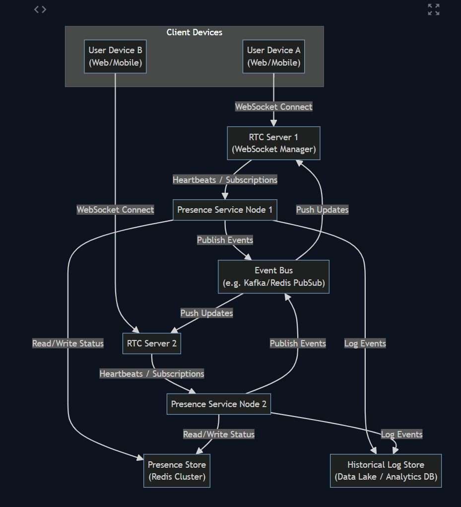

# Design an Online Presence Indicator Service

## System requirements

### Functional:

- Track online presence for users logged in from multiple devices, aggregating into one overall status per user.
- Support status changes: online, idle, and offline.
- Propagate status updates to friends/connections in real time (within 1 second).
- Provide “last seen” timestamps for offline users.
- Log historical presence events (logins, logouts, durations) for analytics.
- Control access to presence data (visibility restricted to friends/connections).
- Assume a simplified model where all friends can view each other’s status.

### Non-Functional:

- Scale to hundreds of millions of users and support tens of millions online concurrently.
- Handle millions of events per second (heartbeats, status changes) with sub-second latency.
- Ensure high availability with no single point of failure.
- Tolerate eventual consistency with sub-second convergence across viewers.
- Secure status updates against spoofing or unauthorized changes.

## Capacity estimation

To support Facebook/LinkedIn scale, the system must handle up to 1 billion users, with 500 million monthly active users and 100 million online concurrently. With an average of 1.5 devices per user, we expect 150 million simultaneous connections, each sending heartbeats every 15–30 seconds—resulting in 5–10 million heartbeat messages per second.

Presence status changes (e.g., login/logout) occur roughly 5 billion times per day, with hundreds of thousands of changes per second at peak. Each change fans out to friends. Typically around 50–100 recipients, generating millions of notification deliveries per second.

Presence state per user is small (~20B), so 1 billion users only requires ~20GB, fitting easily in a distributed cache. Historical logs, however, may grow to petabytes per year and need separate long-term storage and aggregation pipelines for analytics.

Maintaining 150 million concurrent connections demands a large WebSocket infrastructure and efficient real-time message delivery. Although each presence message is tiny, the system must handle tens of millions of updates per second with low latency. The architecture must be horizontally scalable and optimized for high-throughput, low-latency streaming.

For this presence system, WebSocket is preferred because:

- We need to support heartbeats from client to server.
- We want low-latency, real-time push and pull behavior.
- Clients may subscribe/unsubscribe dynamically to user presence streams.

## API design

The presence service uses a mix of persistent WebSocket connections for real-time updates and RESTful APIs for on-demand queries and control.

### Client-Facing APIs

- Connection establishment: Clients open a WebSocket to register presence and receive updates. Establishing the connection marks the device as “online.”
- Heartbeats: Devices send periodic heartbeats over the WebSocket to confirm they’re still online. Missed heartbeats trigger disconnect handling.
- Status updates: Clients can optionally send explicit status changes (e.g., “offline”, “idle”) via POST /presence/status.
- Fetch friend statuses: Clients retrieve presence info for many users in bulk using GET /presence?user_ids=[...]. This is optimized via in-memory caching.
- Subscribe to updates: After fetching presence info, clients subscribe to updates (implicitly or via {"subscribe": [...]}) to receive real-time status changes from friends.
- Receive events: Subscribed clients get push updates over the WebSocket when a friend’s status changes (e.g., Bob comes online → { user: Bob, status: "online" }).
- Historical queries: Optional API endpoints (e.g., GET /presence/history) return user activity history, such as total active time or last seen. Used primarily for analytics or profile services.

### Internal APIs

- Connection tracking: The Real-Time Connection Service informs the Presence Service when a user connects or disconnects, or sends periodic heartbeats (via RPC or UDP).
- Event distribution: The Presence Service emits status change events to a messaging system, which the RTC servers use to push updates to clients.
- Logging: All presence state changes are asynchronously logged (e.g., to Kafka) for analytics and historical reference.

## Idle detection

Idle state can be detected on the client (no activity) or inferred server-side (no interaction beyond heartbeats for a time). Idle state is tracked similarly to online but may be displayed differently.

## Database design

The presence service deals with two categories of data: real-time state (who is online right now, and their recent activity timestamp) and historical logs (a record of past presence events, used for analytics or “last seen” queries). We will use different storage technologies for these, optimized for their access patterns.

### Real-time Presence Store

This is essentially a fast, in-memory key-value store holding the current status of each user (and possibly some per-device info). The requirements for this store are: extremely high read/write throughput, low latency (sub-millisecond reads/writes), and the ability to handle a dataset roughly equal to the number of active users. A distributed in-memory database or cache is suitable. Candidates might include Redis (with clustering), Aerospike, or a custom in-memory service. A distributed key-value store with high read and write capacity is ideal​. In LinkedIn’s implementation, they mention a “distributed K/V store” for presence​ – any store that can handle high volume could be used. For example, a Redis cluster sharded by user ID could store presence entries, or something like Cassandra (tuned for high write throughput) could serve as well, although Cassandra reads are slower (often requiring quorum). Given the read-heavy nature (every time friends come online we do lookups, and users querying friend statuses), an in-memory solution is preferable​.

The schema for the real-time presence store could be:

- Key: User ID (or some unique user identifier).
- Value: A small object containing:
  - status – current state (online, idle, offline).
  - last_active_ts – a timestamp of the last activity or last time the user was seen. If the user is currently online, this might be now (or the time of their last action beyond heartbeat). If offline, this would reflect when they went offline (which is effectively their “last seen” time).
  - Optionally, device_count or device_list – info about how many devices (or which device IDs) are currently connected. We might store, for example, a count of active connections for the user, or even a set of device IDs to know specifics. Storing the list could be useful for debugging or for showing device-specific status (like “Mobile” vs “Web”), but it increases data size. Even a count would allow us to know if a user still has other devices online when one disconnects.

In a simple approach, we might not store each device in the main presence table; instead we manage device-level tracking separately. Another approach is a two-tier storage:

- A User Presence table (UserID -> status + last_active).
- A Device Presence table (maybe keyed by a combination of userID and deviceID -> last_heartbeat_time or status).

However, maintaining separate tables might complicate consistency. It can be sufficient to keep one record per user and update it whenever any device’s status changes. For multi-device logic: when a new device connects, if the user was offline, we set user status to online; if the user was already online via another device, we just increment a counter but keep status online. When a device disconnects, if other devices are still on, the user stays online; if the last device disconnected, we mark the user offline and update last_active_ts. To implement this logic, the presence service may need to track the count of active devices. This can be done either by a field in the store or by keeping ephemeral state in memory. For reliability, it’s safer to store it so that any node can reconstruct state (e.g., user X has N active connections).

One could store a list of deviceIDs with their last heartbeat timestamp. Example value in a NoSQL/JSON form:

```json
{
  "status": "online",
  "last_active_ts": 1670000000,
  "devices": {
      "device1": 1670000000,
      "device2": 1669999900
  }
}
```

Where devices map might hold last heartbeat times. But storing potentially multiple timestamps per user might be overkill; an alternative is to only store the earliest disconnect time needed (for offline detection). Many designs simply use a single expiration per user, resetting it on heartbeats, as described below.

### Presence Entry Expiration

A useful technique is to leverage key expiration as a built-in mechanism to detect offline status​. For example, when a user is online, we set a key for them in the presence store with an expiration TTL of slightly longer than the heartbeat interval. If heartbeats keep coming, we keep extending the TTL (or refreshing the key). If heartbeats stop, the key will automatically expire, signaling the user is offline. Some systems (like a Redis-based design) can use the expiry event to trigger an action (Redis has keyspace notifications on expiry). However, relying purely on key expiry events in a large cluster can be tricky (there might be slight delays and it adds load to the storage). Another approach: maintain the expiration time in the value and have the presence service actively check (via scheduled tasks or an actor model) when it should mark offline. LinkedIn’s approach was to store the heartbeat with an expiry and also set a timer (delayed trigger) to double-check after expiry and then publish offline event​. We can follow a similar approach for reliability.

Concretely:

- When a heartbeat for user X is processed, we write/update an entry in the presence store for X with status="online" and set the TTL to (heartbeat_interval + grace_period). For instance, if heartbeats come every 15s, we might set a TTL of 20s. This means if no further update happens, after 20s the record is removed automatically. The grace_period is to account for minor delays (ε, a few seconds)​.
- The presence service also notes this event. If this is the first heartbeat after an absence (no existing record for X), that means X just came online, so we will generate an “online” event for X to notify others. If an entry already existed (X was already online), we simply update their last_active_ts (which could be their heartbeat time)​.
- We do not necessarily update the store on every single heartbeat if it’s heavy; an alternative is to only update an in-memory timestamp on each heartbeat and perhaps extend the TTL only when needed. But given a distributed store, it might be simpler to overwrite the key each time with a fresh TTL. Modern in-memory stores can handle this rate if scaled out (10 million writes/sec spread over many shards).
- If the key expires (meaning no heartbeat refreshed it in time), that implies the user likely went offline (or lost connection and didn’t come back quickly). The expiration itself could serve as the trigger for offline: e.g., if using Redis, it can publish a notification that key X expired​, which the presence service can listen to in order to mark user X offline and issue an offline event. If using a system that doesn’t support notifications, our presence service can maintain its own timers. For instance, create a scheduled task to check user X after TTL+δ, and if in the store the record is gone or marked expired, then finalize them as offline.

The presence store must support high concurrency. We will partition it by user ID (for example, if using Redis cluster, userID mod N determines the shard). We’ll also replicate data for reliability (each shard can have a master-replica so that if one node fails, a replica has the data). Because the data is ephemeral and can be reconstructed (worst case if we lost it, users would just reappear as offline until next heartbeat), we can prioritize availability over strong consistency here. We want the store to always accept writes and serve reads (AP in CAP theorem sense), even if a few updates might be temporarily lost on a partition (the next heartbeat can correct it). As such, a highly available NoSQL store or cache is appropriate.

### Historical Presence Logs

For long-term analysis and “last seen” queries, we need persistent storage of events. We don’t want to overload the main presence store with infinite history – that store should remain slim and fast. Instead, every time a user’s status changes (online→offline or offline→online, possibly idle transitions too if we log those), we will append a record to a log. This could be done via a message queue or streaming platform: for example, produce an event to Apache Kafka or a similar distributed log whenever a status change occurs. Each event would contain user ID, new status, timestamp, and perhaps metadata (device, etc). Kafka can handle the ingestion of millions of events per second, and those events can then be consumed by other systems for storage and processing.

One consumer of these events could be a historical presence service or a batch job that writes them into a database optimized for analytics. For example:

- A big data pipeline could store all events in HDFS/cloud storage for offline analysis.
- We could have a time-series database or a OLAP datastore (like Apache Druid or ClickHouse) that stores aggregated presence info (e.g., daily active durations).
- For quick lookup of “last seen”, we actually don’t need a complicated query: the main presence store’s last_active_ts for a user when they are offline serves as “last seen”. We should ensure to update that at the moment a user goes offline. For example, when a user disconnects, we set last_active_ts to that disconnect time and status="offline". That stays until they next come online. So any GET /presence?user=X showing offline can directly return that last_active_ts. We might also copy that to a separate table for backup, but it’s not strictly necessary since it’s in the main record.

If we want to provide more detailed history (like showing a log of a user’s sessions), we would query the historical log store. That might be too fine-grained for a user-facing feature, but it’s useful internally or for some “Presence Analytics” dashboard. The data volume for logs is high (potentially billions of entries per day), so a scalable append-only store is needed. Kafka plus a distributed file storage or a NoSQL DB (like Cassandra) in time-series mode could be used. For example, Cassandra is often used for time-series data by bucketing by day: a table like PresenceEvents(user_id, date, [list of events]) could be designed, but writing a row per user per day with many events might be heavy. Instead, a simple approach: write each event as an entry with a composite key (date, user_id, timestamp) to allow retrieval by user and date range. The retention policy can purge older data as needed.

### Friend/Connection Mapping

Although not a “database table” in the traditional sense of storage, the system needs to know who should get notified of whose status changes. This depends on the social graph (friends or connections). We assume we have access to a service or data structure that can quickly tell us the list of friend IDs for a given user. Likely this is stored in a social graph database or derived cache. For real-time notifications, however, it may not be efficient to pull all friend IDs from a database on every status change event. Instead, we might maintain an in-memory subscription list. When user A is online and has the app open, for each friend B of A that A is interested in, A’s client is effectively subscribed. We can manage these subscriptions on the fly via the real-time platform (more on that in design). So we might not explicitly store “who is subscribed to user X” in a persistent DB; it can be ephemeral in the real-time layer.

If needed for resilience, a lightweight store could keep track of subscriptions (e.g., a map of user -> set of subscribers). But given the dynamic nature (users come and go frequently), it’s often handled in memory of the pub-sub system rather than written to disk. We will rely on the real-time pub-sub mechanism to map topics (user’s presence) to subscriber connections.

### Summary of storage choices:

- Presence Cache/DB: A distributed in-memory key-value store (like Redis cluster, or a similar NoSQL store) storing user presence status and last active times. This provides constant-time lookups and updates, supporting heavy concurrent access​.
- Backup store (optional): Possibly a persistent database (SQL or NoSQL) to periodically backup the presence cache (in case of full system restart, we might want to know which users were last seen when – though after a total reboot, everyone would be considered offline until they reconnect anyway).
- Message Queue for events: Kafka or an equivalent to stream presence changes to interested subsystems (and to decouple real-time processing from logging).
- Historical analytics storage: A data warehouse or time-series DB for logs. For example, store daily aggregates in an SQL table for reporting average online time, etc., and raw events in cheaper storage if needed.

By separating real-time state and historical data, we ensure the live system remains fast and lightweight, while still capturing all data needed for offline analysis.

## High-level design

At a high level, the presence indicator system will consist of several components working in concert. The core idea is to decouple the concerns of presence detection and state management from the delivery of real-time updates. This yields an architecture with two main subsystems:

(1) The Presence Service Platform, which tracks user/device connections, updates the presence store, and determines when to broadcast events

and

(2) The Real-Time Communication Platform, which handles maintaining persistent connections to clients and actually delivering the push notifications to those clients. Additional components handle data storage and processing of the historical analytics.

### Presence Service

A stateless (or lightly stateful) service layer that receives heartbeat signals or direct notifications of user connectivity changes. It houses the business logic to update the user’s status in the presence store and to decide when a user has gone offline (e.g., on heartbeat timeouts). It also generates the events (“User X is now online/offline/idle”) that need to be sent out. The Presence Service runs on many servers for scalability and uses the distributed presence database described earlier.

### Real-Time Connection (RTC) Servers

These are servers that manage long-lived client connections (WebSocket or SSE). They act as a gateway between the user’s device and the backend. When a device sends a heartbeat or any message, it first reaches an RTC server, which can then forward it to the Presence Service (or even directly update some shared store). Conversely, when the Presence Service (or an event bus) emits an event that needs to reach a user’s device, it will go through the appropriate RTC server that that device is connected to. In effect, these servers form a publish/subscribe distribution network. Each online client is “subscribed” to certain event streams (like friends’ presence changes) and the RTC layer ensures each client’s socket gets the right events. These servers need to scale horizontally to handle millions of connections; they typically are stateless regarding user logic, mostly shuffling messages. Load balancers will distribute clients among these servers (often with a hash or sticky mechanism so a given user consistently reconnects to the same server cluster for efficiency).

### Presence Database (Cache)

The distributed in-memory store (discussed in the previous section) that holds current presence info. The Presence Service will read/write this. In some designs, the RTC servers might also directly check this store for info (for example, to quickly respond to a friend list query without involving the Presence Service if the data is readily available). Proper caching and possibly local replicas might be used to reduce cross-datacenter latency if needed.

### Message Broker / Event Bus

A pub-sub mechanism that connects the Presence Service to the RTC servers. One model is that each user’s presence status is a “topic” on this bus. When the Presence Service determines user U’s status changed, it publishes an event on topic “U_status”. Any RTC server that has clients subscribed to U_status will receive that event and then forward it to those clients’ devices. This can be implemented with a distributed messaging system like Kafka or with a custom in-memory pub-sub (for example, some real-time systems use direct server-to-server communication for this). LinkedIn built a dedicated Real-Time Delivery system for such events​. We could also use something like Redis Pub/Sub channels if we keep it simple (though at massive scale, a more robust message bus might be needed). The event bus should be used in a transient way – we don’t need to persist each event (an offline user doesn’t need to queue missed presence notifications). So it can operate in a fire-and-forget mode or with minimal buffering. The systemdesign.one article actually suggests using the persistent connection itself as the pub-sub mechanism to avoid extra complexity​. We will likely integrate the eventing tightly with the RTC layer.

### Historical Logging Pipeline

As mentioned, a Kafka pipeline or similar that records events to storage. This sits on the side and does not interfere with the real-time path; it just passively receives events from the Presence Service and stores them.

### Friend List Service

(or Graph Service) – An external dependency that manages the social graph. The presence system will query this to know who to notify. It might be as simple as each user’s client telling “I want to subscribe to A, B, C” (which it knows because those are friends), or we might have the presence system cross-reference a friend list. At large scale, it’s better not to have the presence service look up friendships on every event (which would be too slow). Instead, we either push that logic to the edges (clients subscribe for what they want) or preload friend lists into memory. For our design, we assume that subscription is handled by clients (which inherently know their friend IDs from when they fetched the friend list). Thus the presence service itself doesn’t constantly query a social graph; it just handles events and trust that whoever subscribed will get it.

Bringing it together, here’s the overall workflow: When a user (publisher) comes online, their device connects to an RTC server, which notifies the Presence Service (directly or via heartbeat). The Presence Service updates the presence DB and sees that this user transitioned from offline to online, so it publishes an “online event” for X to notify others. If an entry already existed (X was already online), we simply update their last_active_ts (which could be their heartbeat time)​. We do not necessarily update the store on every single heartbeat if it’s heavy; an alternative is to only update an in-memory timestamp on each heartbeat and perhaps extend the TTL only when needed. But given a distributed store, it might be simpler to overwrite the key each time with a fresh TTL. Modern in-memory stores can handle this rate if scaled out (10 million writes/sec spread over many shards). If the key expires (meaning no heartbeat refreshed it in time), that implies the user likely went offline (or lost connection and didn’t come back quickly). The expiration itself could serve as the trigger for offline: e.g., if using Redis, it can publish a notification that key X expired​, which the presence service can listen to in order to mark user X offline and issue an offline event. If using a system that doesn’t support notifications, our presence service can maintain its own timers. For instance, create a scheduled task to check user X after TTL+δ, and if in the store the record is gone or marked expired, then finalize them as offline.

The presence store must support high concurrency. We will partition it by user ID (for example, if using Redis cluster, userID mod N determines the shard). We’ll also replicate data for reliability (each shard can have a master-replica so that if one node fails, a replica has the data). Because the data is ephemeral and can be reconstructed (worst case if we lost it, users would just reappear as offline until next heartbeat), we can prioritize availability over strong consistency here. We want the store to always accept writes and serve reads (AP in CAP theorem sense), even if a few updates might be temporarily lost on a partition (the next heartbeat can correct it). As such, a highly available NoSQL store or cache is appropriate.

Now, consider scale-out: there will be many instances of the Presence Service and many RTC servers, possibly distributed across multiple data centers. They coordinate via the shared presence DB and the event bus. To avoid any single component overload, user IDs can be partitioned: for example, a hash-based routing ensures all heartbeats for a given user go to the same Presence Service instance (so that the logic for that user’s timers runs in one place)​. This can be done by the load balancer or a coordinator. The presence DB, being distributed, allows any instance to read/update any user’s status, but for efficiency the sticky routing helps. The RTC servers similarly can be segmented (e.g., by region or randomly assigned). Because the event bus decouples them, a Presence Service instance doesn’t need to know which RTC server to talk to for a given user’s friends – it just publishes to a topic and whichever servers have subscribers will handle it.



## Request flows

Let’s walkthrough several key interactions step by step, to illustrate how the system components work together for different scenarios:

### User Login / Going Online (Happy Path)

Scenario: Alice opens the social app on her phone. She wants to appear online to her friends. Meanwhile, Bob (her friend) is already online and should see Alice’s indicator turn green.

- Alice’s app authenticates and establishes a WebSocket connection to one of the Real-Time servers (let’s call it RTC1). Suppose this happens at time T0. The connection handshake (perhaps an HTTP Upgrade request) is successful, and now a persistent channel is open between Alice’s device and RTC1.
- Upon connection, RTC1 registers that user Alice (user_id=A) is connected (with a given device/session ID). RTC1 might send an internal message to the Presence Service, e.g., “User A connected (device d1)”. Alternatively, as soon as the connection opened, RTC1 could start sending periodic heartbeats on behalf of Alice. Let’s say at T0 it sends a heartbeat event: {user:A, device:d1, ts:T0}.
- A Presence Service instance (let’s call it PS1) receives this heartbeat. Using sticky routing, all of Alice’s heartbeats go to PS1. PS1 checks the Presence DB for Alice’s current status. Before now, Alice was offline (no entry or expired entry in the DB). PS1 then creates/updates Alice’s entry: status = online, last_active_ts = T0, and sets a TTL for the entry (e.g. expires at T0 + 20s)​. It notices this is a transition from offline to online (no unexpired entry existed before) – therefore Alice is a newly online user. PS1 generates an “Alice is online” event. It writes this to the event bus (topic “presence_A”) or directly notifies interested parties via RTC servers.
- PS1 also logs this event asynchronously (e.g., push to Kafka “A went online at T0”).
- Now, Bob’s app has previously subscribed to Alice’s presence. Bob is connected via maybe RTC2 server. RTC2 has a subscription for topic “presence_A” because Bob (user B) is friends with A and his client requested updates for A. The event bus delivers the “Alice online” event to RTC2 (since Bob’s connection is a subscriber). RTC2 then sends a message over Bob’s WebSocket: maybe {user:A, status: "online", timestamp: T0}.
- Bob’s app receives this push message nearly instantly (maybe at T0+ some milliseconds), and updates the UI to show Alice as online. The end-to-end latency from Alice opening her app to Bob seeing her online can be well under a second, mostly network and processing delays.
- Meanwhile, the presence service will continue to get heartbeats for Alice every few seconds. Those heartbeats simply refresh the TTL in the DB (or update a last heartbeat timestamp). No new events are published because her status remains “online”. These heartbeats are silent to other users.

### User Idle Status

- Suppose Alice goes idle (e.g., she hasn’t touched her app for 5 minutes, but the app is still open). If we implement idle, the client or server can decide at time T1 that Alice is idle. Let’s say the client sends a small message “status: idle” over the socket, or the server infers it.
- The Presence Service PS1 updates Alice’s status to “idle” in the presence DB (but keeps her last_active_ts at T0 or perhaps updates it to T1 if we consider last_active as last time of actual activity). It then publishes an event “Alice is idle” to topic presence_A.
- Bob (and any others subscribed) get this update via the RTC servers just like the online event. Bob’s UI might show a different icon (perhaps orange instead of green). Idle state changes are less critical, and some systems might not even broadcast them to reduce noise. But if we do, the mechanism is the same.
- Alice’s device would still be sending heartbeats (idle still counts as online for connectivity). If Alice becomes active again (moves the mouse, etc.), the app could send “status: online” – which PS1 would treat as a transition from idle back to active online, and possibly broadcast “Alice is now active” or just “online” again. We have to consider whether to broadcast transitions between online and idle; this could be an implementation detail. Often, presence is simplified to just online vs offline for others, or idle is shown after a time without an explicit event. For example, clients might locally decide to show someone idle if they see them online but no activity for X minutes, without the server telling everyone. To keep things simpler and traffic lower, we might not broadcast idle state at all, and instead let each client compute it (if needed) based on last activity timestamp. However, since the prompt asked for idle support, we included it as a state the server knows. Either approach is acceptable.

### User Logout / Going Offline (Graceful)

Scenario: Alice closes her app or hits logout explicitly.

- If Alice explicitly logs out or closes the app normally, the app can inform the server. On logout, Alice’s client sends a message over the socket or an HTTP call indicating she is going offline now.
- RTC1 (Alice’s connection server) receives that and knows the connection will terminate. It forwards a message to the Presence Service: “User A disconnected (graceful) at T2”.
- PS1 immediately sets Alice’s presence status to offline in the DB, and updates last_active_ts = T2. It also cancels any pending heartbeat timers for Alice because we now know she’s offline. PS1 then publishes an “Alice is offline” event on the bus.
- Bob’s RTC server picks up this event and Bob’s app gets the update within milliseconds, showing Alice went offline (and possibly showing “last seen at T2” if the UI displays that).
- The WebSocket is closed. If Alice had other devices still online, note that we wouldn’t mark offline. In a multi-device case, when one device disconnects, the presence service would decrement the count of devices for Alice. If the count goes to zero, then mark offline; if not, she remains online via her other devices. In this scenario, assume it was her only device.
- Additionally, PS1 logs “A went offline at T2” to the history log.

### Unexpected Disconnect (Network Issues)

Scenario: Alice is on a train and goes through a tunnel at time T3, losing connectivity abruptly without a chance to notify the server.

- RTC1 will detect that Alice’s WebSocket has dropped (TCP disconnect or timeout). However, network disconnect detection may not be instant – it might realize after a TCP keepalive failure or no pings. Let’s say the RTC server notices after a short period that the socket is dead (could be within seconds if using WebSocket pings, or tens of seconds if relying on timeouts).
- Alternatively, the presence heartbeats themselves serve as detection: PS1 will not receive a heartbeat for Alice at T3+15s. So by ~T3+15s, no heartbeat has refreshed Alice’s presence entry, and at T3+20s the Alice key in the presence DB expires. The presence service likely had a scheduled timer for Alice’s heartbeat (from the last one at T3) set to fire at T3+20s​. When that timer fires, PS1 checks the presence DB and finds Alice’s entry is gone/expired – thus concluding Alice is offline due to timeout.
- PS1 then publishes an “Alice offline” event (this is an offline due to disconnect). This might happen slightly later than an instantaneous disconnect to avoid flapping (we gave her a grace period to reconnect). In our chosen values, roughly 20 seconds after the last known heartbeat, we declare offline. This delay means Bob might not see Alice go gray immediately, but it prevents false alarms for short disconnections. (If sub-second accuracy on offline was needed, we could shorten the interval, but the trade-off is more toggling on unstable networks​).
- If Alice reconnects quickly (say at T3+5s), then a new connection/heartbeat comes before the old entry expired, and the presence service will simply continue to consider her online without ever sending an offline. This is how the heartbeat mechanism handles jittery connections gracefully​.
- In summary, for an ungraceful disconnect, the system relies on heartbeat timeout. The event flow for offline is the same, just triggered by a timer/expiry instead of an explicit message. Bob and others will eventually get the offline notification.

### Retrieving Friend List Presence

- When Bob logs in or opens his friends list page, his client calls GET /presence?user_ids=[list of Bob’s friends]. Suppose Bob has 300 friends. The request hits a Presence Service read endpoint (which could be any instance, since it just reads from the distributed presence DB).
- The presence service fetches those 300 user entries from the presence cache. This can be done in parallel or as a batch if the cache supports multi-get. Because the cache is in memory and possibly local (if a presence service node has a local replica of the data or extremely fast network to it), this lookup should be very quick (a few milliseconds). Out of 300 friends, maybe 50 are online, 20 idle, rest offline. It returns a response listing each friend and their status and last_active_ts (for offline ones).
- Bob’s client then knows who is online right now and can display that list (often showing online ones at top).
- Immediately after, Bob’s client will use the WebSocket to subscribe to changes for those 300 friends. It might not literally subscribe to 300 individual channels one by one (some optimization could group them), but effectively RTC2 now knows that for each of those 300 userIDs, Bob (via RTC2) should get events. The RTC server or the event bus will maintain Bob’s subscription list.
- As Bob’s friends come online or go offline, Bob will get realtime pushes as described. If Bob closes the friends list or goes offline himself, those subscriptions may be removed (to save resources), but if the design assumes you always want to know friends’ presence while you’re online, Bob might remain subscribed as long as his session is on.

### Multi-Device Scenario

- Alice is logged in on her phone and then also logs in from her laptop. Now she has two active connections. The presence service likely gets a connection event/heartbeat for the second device. It sees an existing record for Alice (from phone) that is unexpired, meaning Alice is already online. So it does not publish a new “online” event (since friends already see her as online). It will update the stored data to reflect two devices. Perhaps it resets the TTL as usual. Essentially, it just notes that now two devices need monitoring.
- If Alice were to go offline on one device (say she closes her laptop but still has the phone), the presence service would detect the laptop’s absence (heartbeats from that device stop). But since Alice still has the phone connection live, we do not mark her offline. We might log internally that one device disconnected, but no user-level event is emitted. Alice’s status stays “online” as long as at least one device is active.
- Only when the last device goes offline will the user be marked offline and an event sent. This logic ensures multi-device support: one user’s presence is a union of all their device sessions.

### Historical Data Access

- If an admin or the user queries their past activity (not a common end-user feature, but to illustrate completeness), the request would go to a different service or an offline job that reads the log database. For example, “when was the last time Alice was online before now?” could be answered by reading the last_active_ts from presence DB (quick answer: that’s the last time she went offline). Or “how many minutes was Alice online yesterday?” would require summing intervals from the log of yesterday’s events, which an analytics service would compute. These queries are not real-time critical and can be handled by batch systems or background APIs. They don’t directly affect the main presence flow, so we design them separately to avoid impacting performance.

These flows cover the lifecycle of presence for users and illustrate how the system handles transitions. The design ensures that for the vast majority of cases, presence changes propagate quickly and correctly to those who need to see them, while handling edge cases (flaky connections, multiple devices) gracefully.

## Detailed component design

Now we delve deeper into each core component, describing how they are built and how they achieve the requirements at scale.

### Presence Service (Core Logic Layer)

This service is essentially the brain of the presence system. It runs as a cluster of processes across many machines. Each instance can handle heartbeats and updates for any user, but for efficiency we prefer to process a given user’s events on the same instance to use in-memory state (timers). We achieve this via consistent hashing or sticky sessions in the load balancer: e.g., hash(user_id) -> one of N presence server nodes. LinkedIn used a similar approach with their d2 load balancer to route all heartbeats of a member to the same node​. This greatly reduces duplicate work and ensures a single node has the context for that user’s presence (like if a timer was set, the next heartbeat will cancel it on that same node).

Each Presence Service instance is stateless in the sense that any important data is stored in the distributed cache or passed in heartbeats, but it does maintain transient state: specifically, timers (or scheduled tasks) for offline detection, and possibly some small cache of recent heartbeat timestamps. For example, when a heartbeat arrives and a user is online, the service sets or resets a timer for that user scheduled at now + (d + δ) to check for a missed heartbeat. This can be implemented efficiently using in-process schedulers or using an actor model. In LinkedIn’s design, they created an Akka Actor per online user to manage the delayed trigger​. Actors are very lightweight (millions can exist) and they handle messages (heartbeats in this case) sequentially, encapsulating the timer state for each user. We could adopt a similar model: when a user comes online, spawn a small state object (or lightweight thread) responsible for waiting for the heartbeat interval; if a new heartbeat comes, cancel/reset the timer; if timer fires without refresh, it triggers the offline event​​. This actor model simplifies reasoning and scales with the number of online users.

Alternatively, if using a platform like Node.js or any event loop, we could maintain a scheduled event per user. But millions of timeouts can overwhelm some runtimes, so an actor approach in a JVM or a highly optimized environment is beneficial​. Another method is to avoid per-user timers by using data store expiry (as mentioned). For instance, if using Redis with key expiry notifications, the presence service might subscribe to those events rather than managing its own timers. The Redis server would then emit an event when a user’s key expires (meaning offline)​, and the presence service would react. This offloads work to the database at the cost of some complexity in tuning expiration.

The presence service also interacts with the presence DB on each event: a heartbeat triggers a read/update, a new online triggers an insert, an offline triggers a delete or update. These operations should be non-blocking or async if possible. A high-performance pattern is to batch operations or use asynchronous pipelines. For example, incoming heartbeats could be buffered slightly and processed in bulk. However, given we want sub-second latency, we likely handle them in streaming fashion.

For multi-device handling, the presence service can maintain a counter or set of deviceIDs for each user. Perhaps the first device coming online triggers an event, increment count =1. Second device: increment count =2 (no event). Each heartbeat would be associated with a specific device ID so we know which device’s timer to reset. Implementation-wise, we might map user->(device_count, last_seen_ts). Or, using actors, one actor per user can manage multiple device heartbeats internally. For example, the actor’s state could hold a map of device->lastHeartbeat. It receives a “heartbeat from device X” message, updates X’s timestamp, and resets the overall timer to now+TTL. If one device disconnects (maybe RTC calls presence service with a specific device ID disconnect), the actor removes that device from its map and if the map becomes empty, triggers offline. This design cleanly encapsulates multi-device logic in one place (the user actor/state). Without an actor model, we can achieve the same by carefully synchronizing updates to the presence store (like using atomic counters for device counts and check if zero).

### Real-Time Connection (RTC) Layer

The RTC servers are essentially a fleet of proxies that maintain connections and forward messages. They might be implemented with technologies specialized for pushing data at scale, such as Node.js (with its async I/O), Netty (Java), or even specialized proxies like Nginx with push modules. Each RTC server needs to handle a large number of concurrent open connections – commonly in the order of tens of thousands or more per machine. This is feasible with event-driven networking and sufficient memory (each connection consumes some memory overhead). The servers should be distributed across multiple geographies for latency and reliability, but from a logical standpoint, we consider them a pool.

When a client connects, a load balancer assigns it to a particular RTC server. A sticky session approach might keep that user on the same server IP for long periods, but if it’s stateless aside from the socket, reconnections can go anywhere (though frequent switching isn’t ideal). Each RTC server must register the connection in a subscription system. One approach is to have the RTC server itself subscribe to relevant topics for that user. For example, Bob connected to RTC2 and subscribed to Alice’s presence; then RTC2 process says “I (RTC2) am subscribing to topic presence_A”. The subscription management could be internal (the RTC server could keep a list of all users for whom it needs to get events, aggregated across its clients, and subscribe once per topic). If multiple of its clients care about the same friend, the RTC server only needs one subscription and it will fan-out to those local clients. This optimization is important because if 1000 clients on one server all have Mark Zuckerberg as a friend, the RTC server should not open 1000 identical subscriptions to Mark’s topic, just one.

The pub-sub event bus connecting presence service and RTC can be implemented in a couple of ways:

- Use a separate messaging system (like Kafka, or RabbitMQ, or NATS) where presence service publishes and RTC servers subscribe. The advantage is decoupling and reliability; the downside is extra hop and complexity. Also, most messaging systems guarantee delivery and may queue messages if a consumer is slow, which is not strictly needed for presence (if a user’s connection is slow or lost, you can drop the update).
- Use a direct path: since the presence service could know which RTC servers have which subscriptions, it could directly send the message to those servers. But tracking that in the presence service cluster can be complex.
- Use the existing persistent connections as the pub-sub channel: Essentially, the RTC server where a friend is connected also holds the friend’s connection. This is the LinkedIn approach where they leverage the same channel used for messaging​. In our design, given multiple servers, we probably lean to a lightweight message bus. Perhaps we can use Redis’s pub/sub feature in a sharded way (as systemdesign.one Figure 4/5 suggests) – for example, each user is a channel, and each RTC server node subscribes to the channels for users that its clients care about. Redis can handle a large number of channels and subscribers if configured properly, but at extreme scale it might be pushing it. Kafka could handle it too by having partitions for presence topics.

One pragmatic solution: partition users by some key and have a set of channels per partition. Then each RTC server subscribes to all partitions (or specific ones) and filters events for users it cares about. This is not super efficient but reduces subscription churn. However, this means all events go to all RTC servers who then drop what they don’t need – that’s wasteful network usage at huge scale. So better is per user or per small group channels. If each user is a channel and each friend’s RTC subscribes individually, the total number of subscriptions = sum of (friends per user for all online users). That could be very high (maybe billions). So we need to optimize.

We can leverage the fact that each user is usually connected in one place: instead of making friends subscribe to friend’s channel, invert it: when Alice goes online, find all her friends who are online right now and directly notify them. How to find them? Perhaps query the presence DB for each friend? That is too slow. Instead, maintain for each user who is online a list of which of their friends are currently online and connected. This essentially mirrors the subscription approach but from the other side. This is also expensive to maintain globally.

Considering trade-offs, the pub-sub model where each user’s presence is a topic that interested parties subscribe to (and unsubscribing when they go offline) is a clean model, albeit potentially heavy with subscriptions. LinkedIn’s real-time system was designed exactly for this: clients subscribe to topics for each connection they care about​. They solved it presumably with an efficient routing mechanism in their service. We will stick with that conceptual model, as it cleanly decouples concerns.

Thus, an RTC server needs a subscription manager module:

- On client subscribe request (for friend list), for each requested friend userID, subscribe to that friend’s channel.
- On client disconnect, unsubscribe all its subscriptions.
- Possibly throttle or limit subscriptions if someone has extremely many (to avoid memory blow-up).
- Under the hood, these could be maintained as a map: friendID -> list of local client connections interested. And friendID -> an active subscription to the event bus (like an open socket to message broker or a callback registration).
- When an event comes from the bus (say “friendID X is online”), the server looks up local clients who subscribed to X and pushes the event to each. If none, then maybe that subscription should have been removed.

### Presence Database

The presence DB (like Redis cluster) should be configured for high performance:

- Sharded across many nodes by user ID hash.
- Possibly using in-memory with backup to disk (AOF in Redis) for durability, though durability is not critical for presence, it could be lost on crash and recovered as everyone offline.
- Replication to have failover in case a node dies, so we don’t lose the ability to read/write that part of the keyspace.
- The data model might utilize Redis data structures. For example, we could maintain an online users set (sorted set keyed by last active time) for some queries, but likely not needed. A simple hash or string per user is enough. If using Redis, a straightforward approach: use a Hash for each user key with fields {status, last_active}. But updating a hash doesn’t allow expiration on individual fields easily (we can expire whole key though). Alternatively, store just a single timestamp with an expiry to detect offline; but then we need status too. Possibly store a simple string “online:<last_ts>” and expire it. If it expires, means offline. And if offline, we could set a separate key for last seen. This might be too many keys; better to keep one key, use TTL for offline detection, and also update another field or another key for last seen at offline time.
- Some designs keep two sets: one set of currently online users (with automatic removals), and an auxiliary storage for last seen. The systemdesign.one article mentions a “sliding window key expiration pattern”​ perhaps to handle network jitter in a slightly different way (maybe they use multiple keys for heartbeats).

Anyway, the presence DB must provide sub-millisecond ops. Each presence service instance will concurrently hit it. So each shard should handle maybe a few hundred thousand ops/sec. If we have 100 shards, that covers tens of millions ops/sec in total.

### Historical Logging and Analytics

A Kafka cluster (with partitioning by user or by time) will receive events. It should be large enough to ingest the peak event rate (which we estimated could be millions per second in bursts). By partitioning by user or group of users, we ensure events for one user appear in order in one partition (useful if we need to reconstruct sessions easily). Consumers might aggregate data. For example, a daily job could read yesterday’s events and compute each user’s total online duration, store that in a summary table. This could then be used to answer queries like “active 5h today” if needed, or just to have metrics.

### Multi-Region Considerations

In a worldwide service, we might deploy presence clusters in multiple data centers (NA, EU, APAC, etc.) to keep latency low. If Alice and Bob are friends across continents, how do we propagate presence? We might need cross-region event forwarding. That adds complexity: possibly a global pub-sub that bridges regions (maybe using data center Kafka mirroring). The presence DB could be globally replicated or segmented by user’s home region. A simple heuristic is to route each user to the nearest data center and handle presence locally; for cross-region friendships, accept a bit more latency as the event might travel from one DC to another. LinkedIn likely had to solve this but that detail is beyond our scope. We mention it here as a complexity that might be tackled by treating the system as multiple deployments that sync certain messages.

### Data Consistency

We should consider how we ensure a user’s status is accurately reflected. Race conditions to watch out for:

- A user rapidly disconnects and reconnects (same device or different device). The presence service might see an offline timer and a new online at nearly the same time. If not careful, it could send an offline event after the online event, confusing receivers. We should design that if a user comes back online quickly, either we cancel the pending offline event (which the actor model or timer reset does)​, or include a timestamp so clients can ignore an out-of-order event. In practice, if we always process heartbeats and timeouts in one place sequentially, we maintain order. E.g., in our actor: if disconnect happened at T3 and reconnect at T3+5, the reconnect heartbeat will arrive and update state, the offline timer that was set for T3+20 will eventually fire but sees the entry is not expired (because it was refreshed by the reconnect), thus it will not send an offline (LinkedIn describes this exact scenario and solution using the delayed trigger check​).
- Multiple devices: ensure that we only send offline when the final device is gone. We might implement this by not actually removing the presence DB key on a single device disconnect if another remains. Instead, maybe keep an online count in the value; if >0, do not delete key on that device’s heartbeat expiry. The logic can be: set key TTL on each heartbeat, but also maybe store a count. This is tricky with just TTL, because TTL is global per key. Alternatively, manage multi-device entirely in the presence service: do not use key expiry as the ultimate source in multi-device scenario. Instead, for multi-device, the presence service might not rely on Redis expiry at all, but handle via its own tracking. For simplicity, one might allocate separate sub-keys per device (like user:device1 keys with TTL) and consider user online if any exist. But then marking offline requires scanning subkeys. Possibly better is an internal map as in actor.

We lean towards the presence service actively managing multi-device and not solely depending on DB expiration for user-level offline. It can use expiration for each device’s key and subscribe to those. For example, presence: userID : deviceID with TTL. When one expires, presence service receives it and updates user’s device count. If count == 0, then mark user offline and remove main user key. This is more complex to implement but ensures correctness. In trade-offs we’ll consider this complexity.

Scaling and Fault Tolerance within components:

- The Presence Service cluster should be behind a load balancer that hashes userIDs to nodes. If a node fails, the load balancer can send subsequent heartbeats for those users to a different node. The presence DB ensures that other nodes can still read the last heartbeat timestamp. There is a slight risk that a timer on the failed node doesn’t fire – meaning an offline might be detected late. But if heartbeats stop, eventually another node seeing the DB with expired entry might realize and fix it. We might incorporate a mechanism: if a node dies, maybe proactively mark all users it handled as needing re-evaluation, but that’s complex. Generally, eventual consistency here is acceptable; users might show online for a bit longer until TTL expires naturally and triggers key expiry events which another node could catch via subscription. We aim for high availability such that even with node failure, the system self-heals.
- The RTC servers ideally are stateless regarding subscriptions (they have in-memory state of which clients want which topics, but if one fails, clients reconnect elsewhere and re-subscribe). If a RTC server crashes, all its connected users will be disconnected and appear offline after timeout (unless they quickly reconnect to another server). This is similar to a user experiencing a network drop – the system handles it via heartbeats timeouts. To minimize impact, we should have users reconnect quickly. Perhaps the app detects connection lost and establishes a new one. The presence service might see a brief drop and return. This can cause some false offline/online flicker; to mitigate, we could implement a short grace period on the client side or server side not to immediately mark offline if a known server failure happened. But in general, the architecture tolerates such failures by design.

## Trade offs/Tech choices

### Push vs Pull

We opted for a push-based design (server proactively sending updates to clients via persistent connections) instead of clients polling for status. The push model is essential for real-time experience at scale; polling thousands of clients every few seconds would not scale and would also introduce latency. The trade-off is increased complexity in maintaining connections and subscriptions. However, given the requirement of sub-second updates, push is the clear choice​. Long polling could approximate push but with overhead of repeated HTTP requests; WebSockets/SSE provide a more efficient, low-latency channel.

### WebSocket vs Server-Sent Events (SSE)

We mentioned both as options. SSE (which is one-way server push over HTTP) is simpler (no custom protocol, works over HTTP/2, auto-reconnect), and was recommended in one reference design​. However, SSE is not supported by all environments (especially older browsers) and it’s unidirectional (server to client). We might need client-to-server signals (for example, a user explicitly setting status or sending ACKs). WebSocket is bidirectional and widely supported now, making it a flexible choice. The cost is slightly more complex load balancing and state management than SSE (which rides on HTTP). In a large system, either can be made to work; we choose WebSocket for generality, with SSE as a graceful fallback (and for simpler cases). Both achieve persistent connections needed for instant updates.

### Heartbeat Interval

We must choose how frequently to send heartbeats. A shorter interval (like 5s) gives quicker detection of lost connections but generates more load (every user causes 12 heartbeats/min). A longer interval (like 60s) reduces load drastically but means someone could be offline for up to a minute before others know. We chose a moderate interval (10-30 seconds range) to balance this. LinkedIn used a parameter d (not publicly stated in the excerpt, but possibly ~30s) with some ε (safety margin)​. They explicitly note the trade-off: too low increases load, too high delays detection​. At our scale, even 10s might be heavy but is doable with optimization. We might adjust d dynamically: e.g., on mobile where battery is a concern and presence is less critical, use 60s; on web with stable connections, 15s. This is a tunable parameter. We also incorporate the jitter grace (if a user reconnects quickly, they stay “online” throughout) to avoid flapping​. That improves user experience at the cost of possibly showing someone online for a short time after they actually dropped – a conscious trade-off to handle unreliable networks.

### Use of Distributed Cache vs Relational Database

We chose a distributed key-value store for presence data due to the high throughput and low latency needs​. A relational DB (SQL) could not handle millions of updates per second or the memory-resident working set effectively. NoSQL stores (like Redis or Cassandra) are designed for this access pattern. Redis offers in-memory speed and data structures (with the aforementioned key expiration capability) but would require careful clustering beyond a certain size. Cassandra would offer persistence and horizontal scale, but with higher read/write latencies (several ms) and eventually consistent writes. For presence, we favor immediate consistency within one data center (everyone reading the same key should see the same status after an update). Redis (with replication for HA) tends to provide that; Cassandra might have slight delays. We likely use Redis or Aerospike (which similarly can handle fast operations in memory with persistence backup). The trade-off: using memory caches means if they fail, data might be lost. For presence, that’s acceptable (we can consider everyone offline and let connections re-register). We prioritize availability and speed over absolute durability.

### Stateless vs Stateful Service for Timers

We had a design choice: manage offline timers with an in-memory approach (actor per user or in-process timers) vs rely on the data store’s TTL and notifications. We leaned towards an in-memory actor model because it offers fine control and can handle millions of timers in a scalable way (Akka actors, for example)​. The benefit is more immediate and flexible handling (e.g., we can incorporate custom logic on each timer firing, combine it with other events, etc.). The downside is complexity of managing these in a distributed environment (ensuring only one actor per user globally). That’s where sticky routing helps. If we went with pure Redis key expiry to decide offline, the design simplifies (Redis does the waiting and expiring). Redis’s keyspace notifications could directly tell a service when a user key expired, triggering an offline broadcast​. That is elegant but has its own limitations – if the system is under heavy load, expiry notifications might be backlogged or even dropped if not consumed quickly. Also, in multi-device scenario, a naive expiry per user might not suffice (because one device dropping shouldn’t expire the user if others exist). You’d need per-device keys anyway. So, either approach can work, but we chose the presence service to manage the logic to have more control and easier extension to multi-device and idle logic. The trade-off is a bit more in-memory state on the service nodes, but those are ephemeral and tied to active users only.

### Event Distribution Mechanism

Using a full-fledged messaging system (Kafka, RabbitMQ etc.) vs a lighter in-memory pub-sub vs direct connections – each has pros/cons:

- Kafka is durable and can buffer events if consumers lag, but presence doesn’t need durability (if a user is offline, we drop events to them). Also Kafka has latency on the order of tens of milliseconds at least (though it can be tuned for low latency, but it’s overkill to store to disk and read for something ephemeral).
- An in-memory pub-sub (like Redis pub/sub or a custom solution) has low latency but might not scale to millions of topics easily in a single node. It also doesn’t guarantee delivery if a subscriber is momentarily unavailable (which for us is actually fine).
- A custom solution could be using the RTC servers themselves: since the RTC layer already holds connections, one could elect one of them as a coordinator for each user’s topic (like one of the RTC servers or presence servers tracks “who is interested in X” and directly pushes to those). However, that becomes complicated to coordinate across many servers.

### Using UDP for heartbeats

One notable choice in LinkedIn’s design is using UDP to send heartbeat signals from the real-time layer to the presence service. UDP is lightweight (no connection overhead, less latency) and if a heartbeat is lost, the next one will arrive (heartbeats are frequent, so reliability of each individual one is not critical). We could similarly use a UDP-based heartbeat channel. For example, RTC servers could emit a small UDP packet to the presence service cluster for each heartbeat. The presence service would need to handle unordered, possibly dropped UDP messages – but since heartbeats come regularly, missing one just delays update until next, which might be tolerable unless the interval is large. The alternative is a TCP or internal RPC call per heartbeat, which is more reliable but heavier. At our scale, saving overhead is valuable, so UDP is a clever choice for such ephemeral signals.

### Data consistency vs availability

Presence is a real-time feature where availability (system stays up and responsive) trumps consistency (exact agreement at every millisecond). We are okay with eventual consistency (i.e., if a network partition happens, some friend might see a user online for a bit even if they went offline, until it’s resolved). Therefore, our system is built on caches, async messages, and not on global transactions. We avoid using distributed transactions or coordination (like locking). We chose architectures (AP-oriented data store, pub-sub communication) that allow some updates to be lost or delayed rather than risking a system-wide stall. For example, if a presence event is lost due to network glitch, a client might miss a friend going offline – but when they try to message them, they might realize or the UI might correct on next refresh. This is acceptable compared to guaranteeing every message at cost of performance. We also mitigate lost events by the fact the presence status can be rechecked (the friend’s app can always query for current status if in doubt). So our emphasis is on timeliness and best-effort delivery.

### Edge Cases

There are a few tricky areas:

- If a user has so many friends (like some celebrities on FB have 5000 friends, or on LinkedIn someone might have thousands of connections). Subscribing to thousands of topics and handling that might be heavy for that user’s connection. We might need to batch updates or enforce some limit. But given these networks often do have such cases, we should handle it. Possibly, if one user (celebrity) goes online and 500k people follow them, that’s like a huge fan-out. Usually presence is limited to mutual connections, not one-directional follow (except e.g. Twitter but they don’t show presence). So we are safe that it’s bounded by friend counts (which are typically not in the millions).
- Idle detection: we included it but one could drop it to simplify (just have online/offline). Idle states are nice-to-have but they do add overhead (the system or client has to track user activity, etc.). It’s doable though.

### Alternate designs considered

We thought about using client-only detection for offline. For example, could we avoid server heartbeats by making clients inform when they disconnect? The problem is ungraceful disconnects (crash, network cut) – server wouldn’t know. We need a server-side detection, hence heartbeats or ping/keepalive is mandatory for fidelity. Another idea: Use a database like Cassandra for the presence store so that we have persistence and multi-data center replication. It would make the presence service stateless and durable, but Cassandra’s latency for millions of tiny writes might cause higher delays (3-5 ms per write vs sub-ms in Redis) and it might not support quick expiration as nicely. So we stuck with an in-memory solution.

Why not just query database for friends on each view update instead of subscribe? Because that would be too slow and also not continuous. The subscribe model ensures you get continuous updates. Polling the DB for each friend’s status regularly would be O(friends * check frequency) per user – unscalable.

User Privacy

not deeply covered, but one might allow “appear offline” or restrict who sees status. The design would enforce that either in the subscription phase (only allow subscribers that are authorized) or presence service filters events for unauthorized. This is an extension but doable (just more checks per event, maybe lower performance or precomputed allowed lists).

In summary, our choices revolve around achieving real-time performance at huge scale by combining:

- In-memory data and ephemeral signals for speed.
- Partitioning and horizontal scaling for throughput.
- Loose coupling via pub-sub patterns for distribution.
- Graceful degradation (preferring slight staleness over system unavailability).

## Failure scenarios/bottlenecks

### Single Server Failure (Presence Service Node)

If one instance of the presence service crashes, the load balancer will route future heartbeats for affected users to another instance. The presence DB being centralized (distributed but globally accessible) ensures that any new instance can read the last known status. The main risk is that any timers or actors on the failed node for currently online users are lost. This could cause some users not to be marked offline promptly. However, the presence DB keys for those users will eventually expire (since heartbeats might not be processed during the failover). If using Redis key expiry notifications, those will still happen, and another service instance subscribed to those events might catch them. If not, worst-case those users might remain marked online for a bit longer until perhaps their friend’s client queries and finds them offline (or until they reconnect and refresh state).

To mitigate the above, we might design presence service such that on startup it scans for any keys that are expired or about to expire and handle them. Or have multiple instances share responsibility for timers (maybe an actor per user lives on multiple nodes with a backup – but that’s complicated). We likely accept a minor inconsistency during a crash. Given the user likely lost connection if the presence node handling them died (because heartbeats from RTC might not get through momentarily), it’s analogous to a network issue which we already handle with a slight delay. So this is acceptable.

### Single Server Failure (RTC Server)

If an RTC server goes down, all clients connected to it get disconnected. They’ll attempt to reconnect, possibly to a different RTC server. The presence service heartbeats from those users will stop from that server. Within one heartbeat interval, presence service will start timing them out (unless they reconnect very quickly through another server which then resumes heartbeats). Users might see friends flicker offline then online. It’s similar to a network partition. The system recovers as clients reconnect. To reduce impact, we ensure multiple RTC servers and that clients have fast reconnection logic. Perhaps the client library can try another server within a second or two, meaning many users might reconnect before the presence TTL expires (thus their online status in DB never fully goes away, or only goes away briefly). Thus, a crash might not even propagate offline events if reconnection is fast enough. But if it does cause offline/online blips, that’s generally okay.

### Network Partition

Suppose one data center is isolated. Users in that DC might get disconnected from others. In a partition, if presence service and RTC are separated (like presence DB is elsewhere), things could get messy. Ideally, we deploy presence service and DB per region to avoid cross-data-center dependencies. But if not, a network partition might make a chunk of the userbase appear offline to the rest. When partition heals, a flood of updates might come as everyone goes online. We must handle that surge gracefully (the system is designed for bursts though, so it should handle many coming online at once).

### Data Store Failure

If the Redis cluster experiences a failure on one shard, it might lose some keys or be unavailable briefly. Because we don’t heavily rely on durable storage, this is not catastrophic to user experience (it’s not like losing a bank transaction). If one shard goes down, the presence service may fail to read/write for users whose IDs map to that shard. We should have replication: Redis Sentinel or cluster can promote a replica within a second or two. During that failover window, some heartbeats will error out. The presence service should handle DB write failures gracefully (maybe retry a couple times; if still down, perhaps drop the heartbeat or mark user offline preemptively). Once the DB is back, clients will either reconnect or send fresh heartbeats. If any presence keys were lost (say the shard had to restart without AOF), those users would appear offline incorrectly. But as soon as they send another heartbeat or any activity, they’ll be marked online again. We can also mitigate by having fallback: presence service might keep an in-memory “shadow state” that if DB is down, it still knows some user is online due to timers not elapsed yet. But for simplicity, we likely accept a brief inconsistency.

### Bottleneck: Load Balancer or Networking Limit

With 150 million concurrent connections, the front-end load balancers and network IO are extreme. If the LB fails or gets overloaded, many clients lose connection. We’d need redundant LBs, possibly DNS-level round-robin across multiple VIPs. Throughput might also hit limits: for example, broadcasting millions of messages per second across data center network. We should ensure using efficient binary protocols or at least avoid verbose payloads to keep each message small. If each presence event is like 50 bytes, then 10 million/sec is 500 million bytes/sec (~500 MB/sec) which is a lot but can be distributed across many machines and network links. The system likely uses compression or at least binary encoding to minimize that.

### Hot User (Thundering Herd)

If a user with an enormous number of friends (or followers, if that concept existed) changes status, it could trigger a storm of messages. For example, if someone has 100k people who see their presence (think a popular public figure in a group chat context?), that’s 100k outbound events at once. This could strain one presence node or one RTC server if all those subscribers happened to be on one server (likely they are not all on one server, they’d be across many). The message bus should distribute that load. But it’s a case to consider; in worst-case, maybe we rate-limit presence events for extremely high-fanout users (or just rely on the system to naturally distribute because those 100k people are on many RTC servers so each deals with a fraction).

### Data Consistency Issues

Possibly a user’s presence flips incorrectly due to race conditions (e.g., offline event arrives to client after an online event). If that happens, the client might show wrong info (like you see friend offline even though they came online). To handle this, we can include a timestamp or sequence in events so clients can choose the latest. E.g., “online at 12:00:05” vs “offline at 12:00:00” – the client sees the online came later and overrides. Or the presence events can be implicitly ordered by delivery (if using one channel, they’ll come in order from that service). Our design’s sticky routing and single-writer per user model ensures order on the server side; only concern is network reorder. With TCP (WebSocket) it’s in order per connection. If two events go to same subscriber via the same RTC, they’ll arrive in order sent. So likely it’s fine. Testing such edge cases is important.

### Storage Overload

The historical logs might grow huge or Kafka might get backed up if consumers lag. This doesn’t affect live service directly (if Kafka backlog grows, oh well, we might drop old presence events after some time). We should set retention or something for those logs to avoid indefinite growth. If analytics are too slow, it doesn’t take down presence.

### Bottleneck: Subscription Management

One worry: if every user with N friends subscribes to N topics, the total subscription count is (#users_online * avg_friends_online). This could be enormous (say 100M * 50 = 5 billion). No system can literally hold 5 billion distinct subscriptions easily in memory without careful design. But realistically, many friends overlap (A subscribes to B and C, B might subscribe to C etc). Still, we might look for optimizations. Many chat presence systems use multicast addresses in network-level or optimize by communities (e.g. concept of “buddy list channels”). If this becomes a bottleneck, one might consider grouping: e.g., rather than each friend separately, each user’s entire friend list could be one channel for that user. Actually we already do that (topic per user). So it’s already grouped by publisher. So number of topics = #users_online (100M perhaps). That is still huge for, say, Kafka (100M topics is impossible). For a custom solution like LinkedIn’s, they probably didn't create actual separate queue objects for each user but had a way to route by key.

One way to handle it is something like: use a consistent hashing ring for events. If you have, say, 1000 partitions in your event system, you can map each user’s events to one partition (just like Kafka would with key = user). Each RTC server then doesn’t subscribe to individual users, but to a partition that covers all the users its clients care about. This is more feasible: 1000 partitions vs millions topics. But then the RTC has to filter events (checking userId in the message to see if any local client wants it). That’s extra processing but might be okay if done in memory. It's a classic space vs compute tradeoff. For simplicity, we assumed direct topics. But a production system might indeed do something akin to that to avoid maintaining millions of subscriber lists. The presence service publishes to a partition (like a Kafka partition) which multiple RTC servers consume, then each filters. This is basically how a Kafka consumer group might work. The latency might go up slightly (because of the filtering overhead and maybe a pull model unless using Kafka’s push – but Kafka is pull by consumers which adds latency). If we did our own pub-sub, we could implement push of partitions.

### Memory usage

Each presence service node’s actors for each online user consume memory. If 100M online, spread across maybe 100 nodes, that’s 1M actors per node, which is heavy but possibly okay in Akka (they said millions of actors is fine】. Each actor maybe a few KB, so a few GB of memory usage, which is okay. But we’d provision accordingly.

### Testing and Monitoring

We would need strong monitoring – e.g., track heartbeats processed per second, queue lengths, number of online users in DB vs what presence service thinks, etc. If heartbeats slow down, that indicates a problem. The system should degrade gracefully; e.g., if it’s overloaded, maybe increase heartbeat interval or drop idle detection to reduce load.

In summary, our design aims to eliminate single points of failure and manage load via horizontal scaling. Potential bottlenecks like the subscription model or message dissemination have strategies to cope if they become problematic (e.g., introduction of intermediate partitioning). Given known patterns from existing implementations and careful capacity planning, the system should handle peak loads with resilience against common failure modes.

## Future improvements

### Optimizing Subscription/Notification Mechanism

As discussed, if the number of subscriptions (friend connections) becomes too large to manage individually, we may introduce a more aggregated pub-sub model. One improvement is to implement a hierarchical subscription: for example, each user’s presence events are tagged by userID, but delivered via sharded channels to spread load. We might also leverage proximity: if a lot of the same sets of users are friends (say in a small network community), we could have a combined channel. However, this is complex and often not worth it; simply scaling out and adding more servers can handle increasing load for a long time.

### Adaptive Heartbeat Interval

Not all users need the same heartbeat frequency. We could make the server smart: if a user’s connection is very stable or on desktop, maybe use 30s heartbeats; if on mobile with known frequent drops, maybe 10s to catch reconnections quickly (or vice versa: on mobile we might conserve battery and trust OS signals for connection state). We could also detect patterns: if a user keeps disconnecting every 20s and reconnecting, maybe slow the toggling by extending their grace period more. Essentially, adapt to network conditions to reduce backend thrash.

### Idle and Activity Detection Enhancements

Currently idle might just be a simple timer. We could integrate with actual app activity, such as typing indicators or last message sent. But more interestingly, we could feed presence data into an “Active Now” recommendation system – e.g., show users who are currently active to encourage interaction. Or highlight if a whole group is active, etc. This is more a feature than an improvement, but having the robust presence system allows these product features.

### Cross-Platform and Federation

Perhaps integrate presence across multiple products (for example, Facebook and Instagram might share presence status if desired). This requires federation or a unified presence backend. In future, our design could be extended to support multiple identity domains, or even become a service that other apps use via API (with proper access control). That means we might open up the API to query presence of users in other systems or allow external subscription. This needs careful security but could be valuable (imagine a corporate wanting to know if a user is online on LinkedIn for an integration).

### Reduce Memory Footprint

If memory usage of timers (actors) is high, we can explore using timing wheels or calendar queues to manage timeouts more collectively rather than per user, which can drastically cut overhead. For example, use a min-heap of expiration times to pop off expired ones, rather than separate timers. Akka probably does something like that under the hood, but if we roll our own, we’d consider that.

### Better Offline Detection via Network Signals

Sometimes relying on heartbeats alone means waiting the full interval for offline detection. We could incorporate TCP FIN or RST signals (when a client disconnects normally, the socket closure can be caught immediately by the RTC server, and we can mark offline quicker). In our design, we do handle explicit logout quickly. But also, WebSockets can have a ping/pong at TCP level to detect dead connections faster than waiting for heartbeat. If not already in use, adding a low-level keepalive (like TCP keepalive with a 5s probe) could catch disconnects earlier than 15s. However, that can increase network noise. It’s a trade-off. Perhaps configure it moderately (detect in ~5s instead of waiting full 15s heartbeat, as a backup if heartbeats are missed).

### Horizontal Partitioning of Presence Data by Region

As the service grows, global scale might necessitate splitting the presence database into region-specific segments to keep latency low. For example, maintain separate presence clusters in Americas, Europe, Asia, and have them sync summary info. If a friend is in another region, perhaps you subscribe cross-region with a bit more latency. Or we use an eventually consistent multi-master for presence DB (which is complex but maybe via Cassandra multi-dc). That would allow a truly global unified presence but at cost of some delays. Initially, maybe not needed, but future might demand it as user base and connection distribution evolve.

### Historical Data Aggregation

Build a user-facing feature or admin tool that leverages the presence history: “Last month, you were active for X hours.” Or for security, show account owner where and when their account was active (to detect suspicious logins). This is already feasible with our logs; it’s just productizing it. Also, feeding historical presence into ML models (to predict when a user is likely online, or to rank chat lists by probability of being online soon, etc.) could enhance user experience.

### Alerting and Auto-Scaling

Implement advanced monitoring where if the heartbeat processing lag exceeds a threshold (meaning maybe presence service can’t keep up), automatically spin up more presence service instances or Redis shards. Similarly for RTC servers if number of connections per server is growing. Cloud environments allow such elasticity.

### Edge Computing Consideration

Perhaps use edge servers (CDN-like edge workers) to handle some presence tasks for users in certain regions, then funnel consolidated info back. This could reduce round-trip latency for those users and offload central cluster. But it introduces replication complexity.

### Consider Using Emerging Tech

Newer technologies like WebTransport or HTTP/3 push, etc., could eventually replace WebSocket with more standardized, multiplexed streams (QUIC protocol). As those mature, the service might migrate to them for better performance on unreliable networks (QUIC handles packet loss better, etc.). Also, using GraphQL subscriptions as an interface might ease client development (though under the hood it’s still WebSocket).
